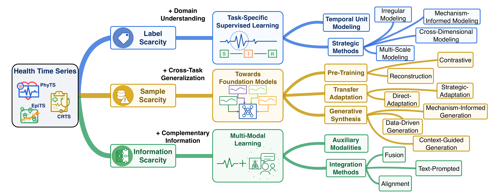
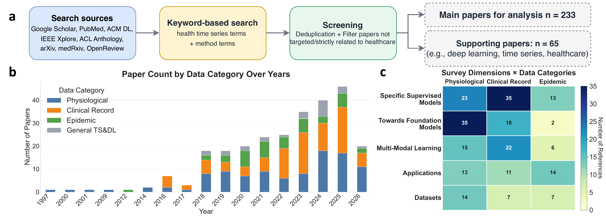
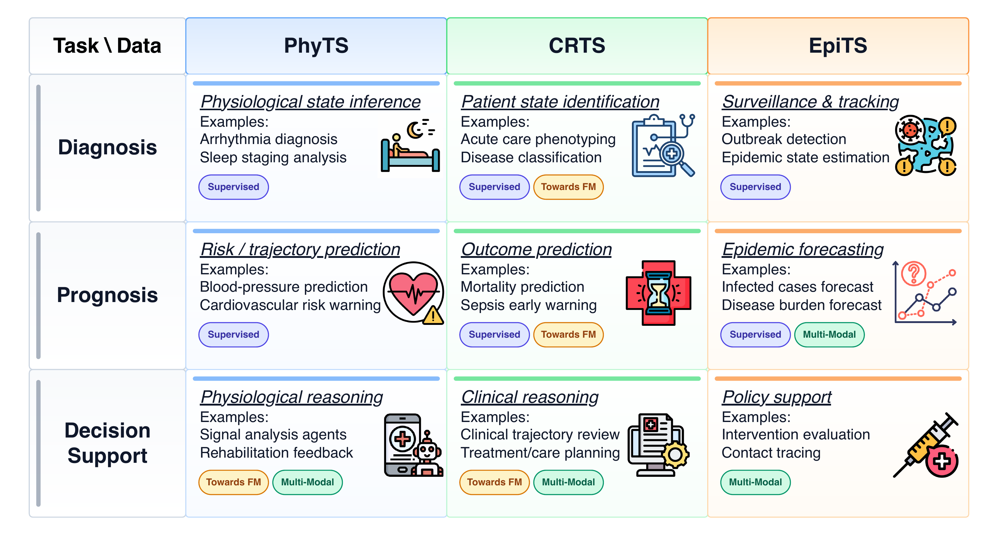

# Deep Learning for Health Time Series: Physiological Signals, Clinical Records, and Epidemic Dynamics

[](https://awesome.re)

A curated repository for the survey **Deep Learning for Health Time Series: Physiological Signals, Clinical Records, and Epidemic Dynamics** (under review).

This README is aligned with the manuscript citations rather than the full BibTeX file: only papers cited in the active `.tex` manuscript are listed, while unused BibTeX entries are excluded.

<p align="center">
  
</p>

## Overview

Health time series (HTS) capture dynamic health processes at three levels: **physiological signals** at the organ level, **clinical record time series** at the patient level, and **epidemic time series** at the population level. The survey organizes this literature around a scarcity-driven methodological trajectory:

| Scarcity | Challenge | Main Paradigm |
|:---|:---|:---|
| **Label Scarcity** | Expert annotations are expensive, delayed, or noisy | **Task-Specific Supervised Learning** |
| **Sample Scarcity** | Task-specific samples are often limited, requiring cross-task pre-training, transfering, and target-domain generalization | **Foundation Models, Transfer Adaptation, and Generative Models** |
| **Information Scarcity** | Time series alone provide only a partial view of the underlying health state | **Multi-Modal Learning** |


## Table of Contents

- [Survey Methodology](#survey-methodology)
- [Papers by Methodological Paradigm](#papers-by-methodological-paradigm)
- [Papers by Application Domain](#papers-by-application-domain)
- [Datasets and Benchmarks](#datasets-and-benchmarks)
- [Supporting References Used in the Manuscript](#supporting-references-used-in-the-manuscript)
- [Citation](#citation)
- [Contact](#contact)

## Survey Methodology

This repository follows the survey methodology used in the manuscript. We conducted a systematic literature review to synthesize recent progress in deep learning for health time series, with an emphasis on organizing the literature by **data category**, **modeling challenge**, and **methodological paradigm** rather than by a single disease, modality, or clinical task.

<p align="center">
  
</p>

The search mainly covered papers published from **2016 to May 2026**, with the final search update completed in **May 2026**. We searched major academic databases and publication platforms, including **Google Scholar**, **PubMed**, **ACM Digital Library**, **IEEE Xplore**, **ACL Anthology**, **arXiv**, **medRxiv**, and **OpenReview**.

The search used three groups of keywords: (i) HTS data terms, including health time series, medical time series, ECG, EEG, PPG, EMG, ICU records, EHR trajectories, and infectious-disease surveillance data; (ii) method terms, including RNNs, Transformers, contrastive learning, foundation models, generative models, and multi-modal learning; and (iii) challenge terms, including irregular sampling, missingness, data scarcity, distribution shift, and measurement noise.

After deduplication and relevance filtering, the final manuscript reference set contains **298 papers**, including **233 main-analysis papers** and **65 supporting references**.

## Papers by Methodological Paradigm

### Basic Temporal Unit Modeling

| Title | Venue | Date | Paper_Link |
|:---|:---|:---:|:---:|
| **Deepr: a convolutional net for medical records** | IEEE JBHI | 2016 | [arXiv](<https://arxiv.org/abs/1607.00575>) |
| **RETAIN: An interpretable predictive model for healthcare using reverse time attention mechanism** | NeurIPS | 2016 | [paper](<https://proceedings.neurips.cc/paper/2016/hash/231141b34c82aa95e48810a9d1b33a79-Abstract.html>) |
| **EEGNet: a compact convolutional neural network for EEG-based brain–computer interfaces** | Journal of neural engineering | 2018 | [paper](<https://iopscience.iop.org/article/10.1088/1741-2552/aace8c>) |
| **Detection of paroxysmal atrial fibrillation using attention-based bidirectional recurrent neural networks** | 24th ACM SIGKDD international conference on knowledge discovery & data mining | 2018 | [scholar](<https://scholar.google.com/scholar?q=Detection%20of%20paroxysmal%20atrial%20fibrillation%20using%20attention-based%20bidirectional%20recurrent%20neural%20networks%20Shashikumar%202018>) |
| **Attend and diagnose: Clinical time series analysis using attention models** | AAAI | 2018 | [arXiv](<https://arxiv.org/abs/1802.02542>) |
| **Deep learning for epidemiological predictions** | The 41st international ACM SIGIR conference on research & development in information retrieval | 2018 | [paper](<https://dl.acm.org/doi/10.1145/3209978.3210079>) |
| **Cardiologist-level arrhythmia detection and classification in ambulatory electrocardiograms using a deep neural network** | Nature Medicine | 2019 | [paper](<https://www.nature.com/articles/s41591-018-0268-3>) |
| **Automatic diagnosis of the 12-lead ECG using a deep neural network** | Nature Communications | 2020 | [arXiv](<https://arxiv.org/abs/1904.01949>) |
| **BEHRT: transformer for electronic health records** | Scientific Reports | 2020 | [paper](<https://www.nature.com/articles/s41598-020-62922-y>) |
| **Prediction and analysis of COVID-19 positive cases using deep learning models: A descriptive case study of India** | Chaos, solitons & fractals | 2020 | [scholar](<https://scholar.google.com/scholar?q=Prediction%20and%20analysis%20of%20COVID-19%20positive%20cases%20using%20deep%20learning%20models%3A%20A%20descriptive%20case%20study%20of%20India%20Arora%202020>) |
| **A convolutional neural network-based architecture for EMG signal classification** | 2021 International conference on data analytics for business and industry (ICDABI) | 2021 | [scholar](<https://scholar.google.com/scholar?q=A%20convolutional%20neural%20network-based%20architecture%20for%20EMG%20signal%20classification%20Briouza%202021>) |
| **Med-BERT: pretrained contextualized embeddings on large-scale structured electronic health records for disease prediction** | NPJ digital medicine | 2021 | [paper](<https://www.nature.com/articles/s41746-021-00455-y>) |
| **CEHR-BERT: Incorporating temporal information from structured EHR data to improve prediction tasks** | Machine learning for health | 2021 | [paper](<https://proceedings.mlr.press/v158/pang21a.html>) |
| **Long-term prediction for temporal propagation of seasonal influenza using transformer-based model** | JBI | 2021 | [scholar](<https://scholar.google.com/scholar?q=Long-term%20prediction%20for%20temporal%20propagation%20of%20seasonal%20influenza%20using%20transformer-based%20model%20Li%202021>) |
| **Sleeptransformer: Automatic sleep staging with interpretability and uncertainty quantification** | IEEE TBME | 2022 | [paper](<https://ieeexplore.ieee.org/document/9709655>) |
| **Neurobolt: Resting-state EEG-to-fmri synthesis with multi-dimensional feature mapping** | NeurIPS | 2024 | [scholar](<https://scholar.google.com/scholar?q=Neurobolt%3A%20Resting-state%20EEG-to-fmri%20synthesis%20with%20multi-dimensional%20feature%20mapping%20Li%202024>) |
| **ECG-MoE: Mixture-of-Expert Electrocardiogram Foundation Model** | NeurIPS 2025 Workshop on Learning from Time Series for Health | 2025 | [arXiv](<https://arxiv.org/abs/2603.04589>) |
| **Dynamic beat-to-beat measurements of blood pressure using multimodal physiological signals and a hybrid CNN-LSTM model** | IEEE JBHI | 2025 | [scholar](<https://scholar.google.com/scholar?q=Dynamic%20beat-to-beat%20measurements%20of%20blood%20pressure%20using%20multimodal%20physiological%20signals%20and%20a%20hybrid%20CNN-LSTM%20model%20Xiang%202025>) |
| **SE-Diff: Simulator and Experience Enhanced Diffusion Model for Comprehensive ECG Generation** | ICLR | 2026 | [arXiv](<https://arxiv.org/abs/2511.09895>) |
| **PG-LRF: Physiology-Guided Latent Rectified Flow for Electro-Hemodynamic PPG-to-ECG Generation** | arXiv preprint arXiv:2605.12541 | 2026 | [arXiv](<https://arxiv.org/abs/2605.12541>) |

### Multi-Scale Modeling

| Title | Venue | Date | Paper_Link |
|:---|:---|:---:|:---:|
| **Stagenet: Stage-aware neural networks for health risk prediction** | Proceedings of the web conference 2020 | 2020 | [scholar](<https://scholar.google.com/scholar?q=Stagenet%3A%20Stage-aware%20neural%20networks%20for%20health%20risk%20prediction%20Gao%202020>) |
| **Adacare: Explainable clinical health status representation learning via scale-adaptive feature extraction and recalibration** | AAAI | 2020 | [scholar](<https://scholar.google.com/scholar?q=Adacare%3A%20Explainable%20clinical%20health%20status%20representation%20learning%20via%20scale-adaptive%20feature%20extraction%20and%20recalibration%20Ma%202020>) |
| **Hitanet: Hierarchical time-aware attention networks for risk prediction on electronic health records** | 26th ACM SIGKDD international conference on knowledge discovery & data mining | 2020 | [scholar](<https://scholar.google.com/scholar?q=Hitanet%3A%20Hierarchical%20time-aware%20attention%20networks%20for%20risk%20prediction%20on%20electronic%20health%20records%20Luo%202020>) |
| **Enhancing spatial spread prediction of infectious diseases through integrating multi-scale human mobility dynamics** | 31st ACM International Conference on Advances in Geographic Information Systems | 2023 | [paper](<https://dl.acm.org/doi/10.1145/3589132.3625582>) |
| **PulseID: Multi-scale photoplethysmographic identification using a deep convolutional neural network** | Biomedical Signal Processing and Control | 2024 | [scholar](<https://scholar.google.com/scholar?q=PulseID%3A%20Multi-scale%20photoplethysmographic%20identification%20using%20a%20deep%20convolutional%20neural%20network%20Wei%202024>) |
| **EEG-based emotion recognition using multi-scale dynamic CNN and gated transformer** | Scientific Reports | 2024 | [scholar](<https://scholar.google.com/scholar?q=EEG-based%20emotion%20recognition%20using%20multi-scale%20dynamic%20CNN%20and%20gated%20transformer%20Cheng%202024>) |
| **Irregular Multivariate Time Series Forecasting: A Transformable Patching Graph Neural Networks Approach** | Forty-first International Conference on Machine Learning | 2024 | [paper](<https://openreview.net/forum?id=UZlMXUGI6e>) |
| **From Token to Rhythm: A Multi-Scale Approach for ECG-Language Pretraining** | ICML | 2025 | [scholar](<https://scholar.google.com/scholar?q=From%20Token%20to%20Rhythm%3A%20A%20Multi-Scale%20Approach%20for%20ECG-Language%20Pretraining%20Wang%202025>) |
| **Hi-Patch: Hierarchical Patch GNN for Irregular Multivariate Time Series** | Forty-second International Conference on Machine Learning | 2025 | [paper](<https://openreview.net/forum?id=nBgQ66iEUu>) |
| **Hierarchical Time Series Forecasting of COVID-19 Cases Using County-Level Clustering Data** | Operations Research Forum | 2025 | [scholar](<https://scholar.google.com/scholar?q=Hierarchical%20Time%20Series%20Forecasting%20of%20COVID-19%20Cases%20Using%20County-Level%20Clustering%20Data%20Mohanty%202025>) |
| **Learning Recursive Multi-Scale Representations for Irregular Multivariate Time Series Forecasting** | ICLR | 2026 | [paper](<https://openreview.net/forum?id=JEIDxiTWzB>) |
| **HierarNet: Independent Interactive Hierarchical Disease Outbreak Forecasting** | AAAI | 2026 | [scholar](<https://scholar.google.com/scholar?q=HierarNet%3A%20Independent%20Interactive%20Hierarchical%20Disease%20Outbreak%20Forecasting%20Zhang%202026>) |

### Cross-Dimensional Interaction Modeling

| Title | Venue | Date | Paper_Link |
|:---|:---|:---:|:---:|
| **EEGNet: a compact convolutional neural network for EEG-based brain–computer interfaces** | Journal of neural engineering | 2018 | [paper](<https://iopscience.iop.org/article/10.1088/1741-2552/aace8c>) |
| **Deep learning for epidemiological predictions** | The 41st international ACM SIGIR conference on research & development in information retrieval | 2018 | [paper](<https://dl.acm.org/doi/10.1145/3209978.3210079>) |
| **U-Time: A Fully Convolutional Network for Time Series Segmentation Applied to Sleep Staging** | NeurIPS | 2019 | [paper](<https://proceedings.neurips.cc/paper/2019/hash/57bafb2c2dfeefba931bb03a835b1fa9-Abstract.html>) |
| **Automatic diagnosis of the 12-lead ECG using a deep neural network** | Nature Communications | 2020 | [arXiv](<https://arxiv.org/abs/1904.01949>) |
| **Spectral Temporal Graph Neural Network for Multivariate Time-series Forecasting** | NeurIPS | 2020 | [paper](<https://proceedings.neurips.cc/paper_files/paper/2020/file/cdf6581cb7aca4b7e19ef136c6e601a5-Paper.pdf>) |
| **Cola-GNN: Cross-location attention based graph neural networks for long-term ILI prediction** | 29th ACM international conference on information & knowledge management | 2020 | [paper](<https://dl.acm.org/doi/10.1145/3397536.3422204>) |
| **Examining COVID-19 forecasting using spatio-temporal graph neural networks** | arXiv preprint arXiv:2007.03113 | 2020 | [arXiv](<https://arxiv.org/abs/2007.03113>) |
| **Imle-net: An interpretable multi-level multi-channel model for ECG classification** | 2021 IEEE International Conference on Systems, Man, and Cybernetics (SMC) | 2021 | [scholar](<https://scholar.google.com/scholar?q=Imle-net%3A%20An%20interpretable%20multi-level%20multi-channel%20model%20for%20ECG%20classification%20Reddy%202021>) |
| **Developing graph convolutional networks and mutual information for arrhythmic diagnosis based on multichannel ECG signals** | International Journal of Environmental Research and Public Health | 2022 | [scholar](<https://scholar.google.com/scholar?q=Developing%20graph%20convolutional%20networks%20and%20mutual%20information%20for%20arrhythmic%20diagnosis%20based%20on%20multichannel%20ECG%20signals%20Andayeshgar%202022>) |
| **Graph-Guided Network for Irregularly Sampled Multivariate Time Series** | International Conference on Learning Representations | 2022 | [paper](<https://openreview.net/forum?id=Kwm8I7dU-l5>) |
| **Revisiting long-term time series forecasting: An investigation on linear mapping** | arXiv preprint arXiv:2305.10721 | 2023 | [arXiv](<https://arxiv.org/abs/2305.10721>) |
| **BIOT: Biosignal Transformer for Cross-data Learning in the Wild** | NeurIPS | 2023 | [paper](<https://proceedings.neurips.cc/paper_files/paper/2023/file/f6b30f3e2dd9cb53bbf2024402d02295-Paper-Conference.pdf>) |
| **Mbrain: A multi-channel self-supervised learning framework for brain signals** | 29th ACM SIGKDD Conference on Knowledge Discovery and Data Mining | 2023 | [scholar](<https://scholar.google.com/scholar?q=Mbrain%3A%20A%20multi-channel%20self-supervised%20learning%20framework%20for%20brain%20signals%20Cai%202023>) |
| **The capacity and robustness trade-off: Revisiting the channel independent strategy for multivariate time series forecasting** | IEEE Transactions on Knowledge and Data Engineering | 2024 | [scholar](<https://scholar.google.com/scholar?q=The%20capacity%20and%20robustness%20trade-off%3A%20Revisiting%20the%20channel%20independent%20strategy%20for%20multivariate%20time%20series%20forecasting%20Han%202024>) |
| **Mutual distillation extracting spatial-temporal knowledge for lightweight multi-channel sleep stage classification** | 30th ACM SIGKDD Conference on Knowledge Discovery and Data Mining | 2024 | [scholar](<https://scholar.google.com/scholar?q=Mutual%20distillation%20extracting%20spatial-temporal%20knowledge%20for%20lightweight%20multi-channel%20sleep%20stage%20classification%20Jia%202024>) |
| **Neurobolt: Resting-state EEG-to-fmri synthesis with multi-dimensional feature mapping** | NeurIPS | 2024 | [scholar](<https://scholar.google.com/scholar?q=Neurobolt%3A%20Resting-state%20EEG-to-fmri%20synthesis%20with%20multi-dimensional%20feature%20mapping%20Li%202024>) |
| **Knowledge-Empowered Dynamic Graph Network for Irregularly Sampled Medical Time Series** | The Thirty-eighth Annual Conference on Neural Information Processing Systems | 2024 | [paper](<https://openreview.net/forum?id=9hCn01VAdC>) |
| **Irregular Multivariate Time Series Forecasting: A Transformable Patching Graph Neural Networks Approach** | Forty-first International Conference on Machine Learning | 2024 | [paper](<https://openreview.net/forum?id=UZlMXUGI6e>) |
| **Hi-Patch: Hierarchical Patch GNN for Irregular Multivariate Time Series** | Forty-second International Conference on Machine Learning | 2025 | [paper](<https://openreview.net/forum?id=nBgQ66iEUu>) |
| **HyperIMTS: Hypergraph Neural Network for Irregular Multivariate Time Series Forecasting** | Forty-second International Conference on Machine Learning | 2025 | [paper](<https://proceedings.mlr.press/v267/li25ax.html>) |
| **GARLIC: Graph Attention-based Relational Learning of Multivariate Time Series in Intensive Care** | ICLR | 2026 | [paper](<https://openreview.net/forum?id=4ZAwmIaA9y>) |
| **ASTGI: Adaptive Spatio-Temporal Graph Interactions for Irregular Multivariate Time Series Forecasting** | ICLR | 2026 | [paper](<https://openreview.net/forum?id=Wg9Rx5rjgo>) |

### Irregularity and Missingness Modeling

| Title | Venue | Date | Paper_Link |
|:---|:---|:---:|:---:|
| **Deepr: a convolutional net for medical records** | IEEE JBHI | 2016 | [arXiv](<https://arxiv.org/abs/1607.00575>) |
| **RETAIN: An interpretable predictive model for healthcare using reverse time attention mechanism** | NeurIPS | 2016 | [paper](<https://proceedings.neurips.cc/paper/2016/hash/231141b34c82aa95e48810a9d1b33a79-Abstract.html>) |
| **Phased LSTM: Accelerating recurrent network training for long or event-based sequences** | NeurIPS | 2016 | [arXiv](<https://arxiv.org/abs/1610.09513>) |
| **Modeling missing data in clinical time series with rnns** | Machine Learning for Healthcare | 2016 | [scholar](<https://scholar.google.com/scholar?q=Modeling%20missing%20data%20in%20clinical%20time%20series%20with%20rnns%20Lipton%202016>) |
| **Patient subtyping via time-aware LSTM networks** | 23rd ACM SIGKDD international conference on knowledge discovery and data mining | 2017 | [paper](<https://dl.acm.org/doi/10.1145/3097983.3097997>) |
| **Neural ordinary differential equations** | NeurIPS | 2018 | [arXiv](<https://arxiv.org/abs/1806.07366>) |
| **Attend and diagnose: Clinical time series analysis using attention models** | AAAI | 2018 | [arXiv](<https://arxiv.org/abs/1802.02542>) |
| **Recurrent neural networks for multivariate time series with missing values** | Scientific Reports | 2018 | [arXiv](<https://arxiv.org/abs/1711.05225>) |
| **Estimating missing data in temporal data streams using multi-directional recurrent neural networks** | IEEE TBME | 2018 | [scholar](<https://scholar.google.com/scholar?q=Estimating%20missing%20data%20in%20temporal%20data%20streams%20using%20multi-directional%20recurrent%20neural%20networks%20Yoon%202018>) |
| **Brits: Bidirectional recurrent imputation for time series** | NeurIPS | 2018 | [arXiv](<https://arxiv.org/abs/1805.10572>) |
| **Latent ordinary differential equations for irregularly-sampled time series** | NeurIPS | 2019 | [arXiv](<https://arxiv.org/abs/1907.03907>) |
| **Neural controlled differential equations for irregular time series** | NeurIPS | 2020 | [arXiv](<https://arxiv.org/abs/2005.08926>) |
| **BEHRT: transformer for electronic health records** | Scientific Reports | 2020 | [paper](<https://www.nature.com/articles/s41598-020-62922-y>) |
| **CEHR-BERT: Incorporating temporal information from structured EHR data to improve prediction tasks** | Machine learning for health | 2021 | [paper](<https://proceedings.mlr.press/v158/pang21a.html>) |
| **Med-BERT: pretrained contextualized embeddings on large-scale structured electronic health records for disease prediction** | NPJ digital medicine | 2021 | [paper](<https://www.nature.com/articles/s41746-021-00455-y>) |
| **Multi-Time Attention Networks for Irregularly Sampled Time Series** | International Conference on Learning Representations | 2021 | [paper](<https://openreview.net/forum?id=4c0J6lwQ4_>) |
| **CSDI: Conditional score-based diffusion models for probabilistic time series imputation** | NeurIPS | 2021 | [arXiv](<https://arxiv.org/abs/2107.03502>) |
| **CausalGNN: Causal-based graph neural networks for spatio-temporal epidemic forecasting** | AAAI | 2022 | [arXiv](<https://arxiv.org/abs/2202.08762>) |
| **Hi-BEHRT: hierarchical transformer-based model for accurate prediction of clinical events using multimodal longitudinal electronic health records** | IEEE JBHI | 2022 | [arXiv](<https://arxiv.org/abs/2106.11360>) |
| **SurvLatent ODE: A Neural ODE based time-to-event model with competing risks for longitudinal data improves cancer-associated Venous Thromboembolism (VTE) prediction** | Machine Learning for Healthcare Conference | 2022 | [arXiv](<https://arxiv.org/abs/1806.07366>) |
| **Neural ordinary differential equations for modeling epidemic spreading** | Transactions on Machine Learning Research | 2023 | [arXiv](<https://arxiv.org/abs/1806.07366>) |
| **TransformEHR: transformer-based encoder-decoder generative model to enhance prediction of disease outcomes using electronic health records** | Nature Communications | 2023 | [scholar](<https://scholar.google.com/scholar?q=TransformEHR%3A%20transformer-based%20encoder-decoder%20generative%20model%20to%20enhance%20prediction%20of%20disease%20outcomes%20using%20electronic%20health%20records%20Yang%202023>) |
| **TransEHR: Self-supervised transformer for clinical time series data** | Machine Learning for Health (ML4H) | 2023 | [scholar](<https://scholar.google.com/scholar?q=TransEHR%3A%20Self-supervised%20transformer%20for%20clinical%20time%20series%20data%20Xu%202023>) |
| **Warpformer: A multi-scale modeling approach for irregular clinical time series** | 29th ACM SIGKDD Conference on Knowledge Discovery and Data Mining | 2023 | [scholar](<https://scholar.google.com/scholar?q=Warpformer%3A%20A%20multi-scale%20modeling%20approach%20for%20irregular%20clinical%20time%20series%20Zhang%202023>) |
| **SAITS: Self-attention-based imputation for time series** | Expert Systems with Applications | 2023 | [scholar](<https://scholar.google.com/scholar?q=SAITS%3A%20Self-attention-based%20imputation%20for%20time%20series%20Du%202023>) |
| **SADI: Similarity-aware diffusion model-based imputation for incomplete temporal EHR data** | International Conference on Artificial Intelligence and Statistics | 2024 | [scholar](<https://scholar.google.com/scholar?q=SADI%3A%20Similarity-aware%20diffusion%20model-based%20imputation%20for%20incomplete%20temporal%20EHR%20data%20Dai%202024>) |
| **EARTH: Epidemiology-Aware Neural ODE with Continuous Disease Transmission Graph** | Forty-second International Conference on Machine Learning | 2025 | [paper](<https://openreview.net/forum?id=Cnfogmxymj>) |
| **MIRA: Medical Time Series Foundation Model for Real-World Health Data** | The Thirty-ninth Annual Conference on Neural Information Processing Systems | 2025 | [arXiv](<https://arxiv.org/abs/2506.07584>) |

### Mechanism-Informed Modeling

| Title | Venue | Date | Paper_Link |
|:---|:---|:---:|:---:|
| **A dynamical model for generating synthetic electrocardiogram signals** | IEEE TBME | 2003 | [paper](<https://ieeexplore.ieee.org/document/1188234>) |
| **Mathematical models of infectious disease transmission** | Nature Reviews Microbiology | 2008 | [scholar](<https://scholar.google.com/scholar?q=Mathematical%20models%20of%20infectious%20disease%20transmission%20Grassly%202008>) |
| **An individual-based approach to SIR epidemics in contact networks** | Journal of theoretical biology | 2011 | [scholar](<https://scholar.google.com/scholar?q=An%20individual-based%20approach%20to%20SIR%20epidemics%20in%20contact%20networks%20Youssef%202011>) |
| **GRAM: graph-based attention model for healthcare representation learning** | 23rd ACM SIGKDD international conference on knowledge discovery and data mining | 2017 | [scholar](<https://scholar.google.com/scholar?q=GRAM%3A%20graph-based%20attention%20model%20for%20healthcare%20representation%20learning%20Choi%202017>) |
| **Neural ordinary differential equations** | NeurIPS | 2018 | [arXiv](<https://arxiv.org/abs/1806.07366>) |
| **Attentive state-space modeling of disease progression** | NeurIPS | 2019 | [scholar](<https://scholar.google.com/scholar?q=Attentive%20state-space%20modeling%20of%20disease%20progression%20Alaa%202019>) |
| **Dynamic-deephit: A deep learning approach for dynamic survival analysis with competing risks based on longitudinal data** | IEEE TBME | 2019 | [scholar](<https://scholar.google.com/scholar?q=Dynamic-deephit%3A%20A%20deep%20learning%20approach%20for%20dynamic%20survival%20analysis%20with%20competing%20risks%20based%20on%20longitudinal%20data%20Lee%202019>) |
| **Stagenet: Stage-aware neural networks for health risk prediction** | Proceedings of the web conference 2020 | 2020 | [scholar](<https://scholar.google.com/scholar?q=Stagenet%3A%20Stage-aware%20neural%20networks%20for%20health%20risk%20prediction%20Gao%202020>) |
| **Neural controlled differential equations for irregular time series** | NeurIPS | 2020 | [arXiv](<https://arxiv.org/abs/2005.08926>) |
| **Deep epidemiological modeling by black-box knowledge distillation: an accurate deep learning model for COVID-19** | AAAI | 2021 | [scholar](<https://scholar.google.com/scholar?q=Deep%20epidemiological%20modeling%20by%20black-box%20knowledge%20distillation%3A%20an%20accurate%20deep%20learning%20model%20for%20COVID-19%20Wang%202021>) |
| **SurvLatent ODE: A Neural ODE based time-to-event model with competing risks for longitudinal data improves cancer-associated Venous Thromboembolism (VTE) prediction** | Machine Learning for Healthcare Conference | 2022 | [arXiv](<https://arxiv.org/abs/1806.07366>) |
| **CausalGNN: Causal-based graph neural networks for spatio-temporal epidemic forecasting** | AAAI | 2022 | [arXiv](<https://arxiv.org/abs/2202.08762>) |
| **Neural ordinary differential equations for modeling epidemic spreading** | Transactions on Machine Learning Research | 2023 | [arXiv](<https://arxiv.org/abs/1806.07366>) |
| **Einns: epidemiologically-informed neural networks** | AAAI | 2023 | [scholar](<https://scholar.google.com/scholar?q=Einns%3A%20epidemiologically-informed%20neural%20networks%20Rodr%5C%27guez%202023>) |
| **Knowledge-Empowered Dynamic Graph Network for Irregularly Sampled Medical Time Series** | The Thirty-eighth Annual Conference on Neural Information Processing Systems | 2024 | [paper](<https://openreview.net/forum?id=9hCn01VAdC>) |
| **Predictive modeling with temporal graphical representation on electronic health records** | Thirty-Third International Joint Conference on Artificial Intelligence | 2024 | [scholar](<https://scholar.google.com/scholar?q=Predictive%20modeling%20with%20temporal%20graphical%20representation%20on%20electronic%20health%20records%20Chen%202024>) |
| **radarODE: An ODE-embedded deep learning model for contactless ECG reconstruction from millimeter-wave radar** | IEEE Transactions on Mobile Computing | 2025 | [scholar](<https://scholar.google.com/scholar?q=radarODE%3A%20An%20ODE-embedded%20deep%20learning%20model%20for%20contactless%20ECG%20reconstruction%20from%20millimeter-wave%20radar%20Zhang%202025>) |
| **EARTH: Epidemiology-Aware Neural ODE with Continuous Disease Transmission Graph** | Forty-second International Conference on Machine Learning | 2025 | [paper](<https://openreview.net/forum?id=Cnfogmxymj>) |
| **SE-Diff: Simulator and Experience Enhanced Diffusion Model for Comprehensive ECG Generation** | ICLR | 2026 | [arXiv](<https://arxiv.org/abs/2511.09895>) |
| **Physiology-Aware Masked Cross-Modal Reconstruction for Biosignal Representation Learning** | arXiv preprint arXiv:2605.00973 | 2026 | [arXiv](<https://arxiv.org/abs/2605.00973>) |
| **DMT: Demographic Conditioning, Morphology-Enhanced Transformer for Cuffless Blood Pressure Estimation from PPG Signals** | arXiv preprint arXiv:2606.11125 | 2026 | [arXiv](<https://arxiv.org/abs/2606.11125>) |

### Contrastive Pre-training

| Title | Venue | Date | Paper_Link |
|:---|:---|:---:|:---:|
| **Representation learning with contrastive predictive coding** | arXiv preprint arXiv:1807.03748 | 2018 | [arXiv](<https://arxiv.org/abs/1807.03748>) |
| **Clocs: Contrastive learning of cardiac signals across space, time, and patients** | ICML | 2021 | [arXiv](<https://arxiv.org/abs/2005.13249>) |
| **Time-Series Representation Learning via Temporal and Contextual Contrasting** | Thirtieth International Joint Conference on Artificial Intelligence, IJCAI-21 | 2021 | [scholar](<https://scholar.google.com/scholar?q=Time-Series%20Representation%20Learning%20via%20Temporal%20and%20Contextual%20Contrasting%20Eldele%202021>) |
| **Unsupervised representation learning for time series with temporal neighborhood coding** | arXiv preprint arXiv:2106.00750 | 2021 | [arXiv](<https://arxiv.org/abs/2106.00750>) |
| **Neighborhood contrastive learning applied to online patient monitoring** | ICML | 2021 | [scholar](<https://scholar.google.com/scholar?q=Neighborhood%20contrastive%20learning%20applied%20to%20online%20patient%20monitoring%20Yeche%202021>) |
| **Contrastive Pre-Training for Multimodal Medical Time Series** | NeurIPS 2022 Workshop on Learning from Time Series for Health | 2022 | [paper](<https://openreview.net/forum?id=4M-D9j9gFHW>) |
| **BIOT: Biosignal Transformer for Cross-data Learning in the Wild** | NeurIPS | 2023 | [paper](<https://proceedings.neurips.cc/paper_files/paper/2023/file/f6b30f3e2dd9cb53bbf2024402d02295-Paper-Conference.pdf>) |
| **Primenet: Pre-training for irregular multivariate time series** | AAAI | 2023 | [scholar](<https://scholar.google.com/scholar?q=Primenet%3A%20Pre-training%20for%20irregular%20multivariate%20time%20series%20Chowdhury%202023>) |
| **Mbrain: A multi-channel self-supervised learning framework for brain signals** | 29th ACM SIGKDD Conference on Knowledge Discovery and Data Mining | 2023 | [scholar](<https://scholar.google.com/scholar?q=Mbrain%3A%20A%20multi-channel%20self-supervised%20learning%20framework%20for%20brain%20signals%20Cai%202023>) |
| **PARSE: A personalized clinical time-series representation learning framework via abnormal offsets analysis** | Computer Methods and Programs in Biomedicine | 2023 | [scholar](<https://scholar.google.com/scholar?q=PARSE%3A%20A%20personalized%20clinical%20time-series%20representation%20learning%20framework%20via%20abnormal%20offsets%20analysis%20An%202023>) |
| **Large brain model for learning generic representations with tremendous EEG data in BCI** | arXiv preprint arXiv:2405.18765 | 2024 | [arXiv](<https://arxiv.org/abs/2405.18765>) |
| **Irregular Multivariate Time Series Forecasting: A Transformable Patching Graph Neural Networks Approach** | Forty-first International Conference on Machine Learning | 2024 | [paper](<https://openreview.net/forum?id=UZlMXUGI6e>) |
| **An efficient contrastive unimodal pretraining method for EHR time series data** | 2024 IEEE EMBS International Conference on Biomedical and Health Informatics (BHI) | 2024 | [scholar](<https://scholar.google.com/scholar?q=An%20efficient%20contrastive%20unimodal%20pretraining%20method%20for%20EHR%20time%20series%20data%20King%202024>) |
| **Large-scale Training of Foundation Models for Wearable Biosignals** | ICLR | 2024 | [paper](<https://openreview.net/forum?id=pC3WJHf51j>) |
| **SiamQuality: A ConvNet-based foundation model for imperfect physiological signals** | arXiv preprint arXiv:2404.17667 | 2024 | [arXiv](<https://arxiv.org/abs/2404.17667>) |
| **Subject-Aware Contrastive Learning for EEG Foundation Models** | NeurIPS 2025 Workshop on Learning from Time Series for Health | 2025 | [paper](<https://openreview.net/forum?id=MdgBATPjEu>) |

### Reconstruction Pre-training

| Title | Venue | Date | Paper_Link |
|:---|:---|:---:|:---:|
| **BERT: Pre-training of deep bidirectional transformers for language understanding** | 2019 conference of the North American chapter of the association for computational linguistics: human language technologies, volume 1 (long and short papers) | 2019 | [arXiv](<https://arxiv.org/abs/1810.04805>) |
| **Language models are few-shot learners** | NeurIPS | 2020 | [arXiv](<https://arxiv.org/abs/2005.14165>) |
| **CEHR-BERT: Incorporating temporal information from structured EHR data to improve prediction tasks** | Machine learning for health | 2021 | [paper](<https://proceedings.mlr.press/v158/pang21a.html>) |
| **Self-supervised transformer for sparse and irregularly sampled multivariate clinical time-series** | ACM Transactions on Knowledge Discovery from Data (TKDD) | 2022 | [scholar](<https://scholar.google.com/scholar?q=Self-supervised%20transformer%20for%20sparse%20and%20irregularly%20sampled%20multivariate%20clinical%20time-series%20Tipirneni%202022>) |
| **Masked autoencoders are scalable vision learners** | IEEE/CVF conference on computer vision and pattern recognition | 2022 | [arXiv](<https://arxiv.org/abs/2111.06377>) |
| **TransEHR: Self-supervised transformer for clinical time series data** | Machine Learning for Health (ML4H) | 2023 | [scholar](<https://scholar.google.com/scholar?q=TransEHR%3A%20Self-supervised%20transformer%20for%20clinical%20time%20series%20data%20Xu%202023>) |
| **Primenet: Pre-training for irregular multivariate time series** | AAAI | 2023 | [scholar](<https://scholar.google.com/scholar?q=Primenet%3A%20Pre-training%20for%20irregular%20multivariate%20time%20series%20Chowdhury%202023>) |
| **TransformEHR: transformer-based encoder-decoder generative model to enhance prediction of disease outcomes using electronic health records** | Nature Communications | 2023 | [scholar](<https://scholar.google.com/scholar?q=TransformEHR%3A%20transformer-based%20encoder-decoder%20generative%20model%20to%20enhance%20prediction%20of%20disease%20outcomes%20using%20electronic%20health%20records%20Yang%202023>) |
| **Brant: Foundation model for intracranial neural signal** | NeurIPS | 2023 | [scholar](<https://scholar.google.com/scholar?q=Brant%3A%20Foundation%20model%20for%20intracranial%20neural%20signal%20Zhang%202023>) |
| **Masked transformer for electrocardiogram classification** | arXiv preprint arXiv:2309.07136 | 2024 | [arXiv](<https://arxiv.org/abs/2309.07136>) |
| **AnyECG: foundational models for multitask cardiac analysis in real-world settings** | arXiv preprint arXiv:2411.17711 | 2024 | [arXiv](<https://arxiv.org/abs/2411.17711>) |
| **Large brain model for learning generic representations with tremendous EEG data in BCI** | arXiv preprint arXiv:2405.18765 | 2024 | [arXiv](<https://arxiv.org/abs/2405.18765>) |
| **MOTOR: A Time-to-Event Foundation Model For Structured Medical Records** | ICLR | 2024 | [paper](<https://openreview.net/forum?id=NialiwI2V6>) |
| **Towards Foundation Models for Critical Care Time Series** | Advancements In Medical Foundation Models: Explainability, Robustness, Security, and Beyond | 2024 | [paper](<https://openreview.net/forum?id=KnakFH5fXz>) |
| **ECG-FM: An open electrocardiogram foundation model** | JAMIA Open | 2025 | [scholar](<https://scholar.google.com/scholar?q=ECG-FM%3A%20An%20open%20electrocardiogram%20foundation%20model%20McKeen%202025>) |
| **REVE: A Foundation Model for EEG - Adapting to Any Setup with Large-Scale Pretraining on 25,000 Subjects** | The Thirty-ninth Annual Conference on Neural Information Processing Systems | 2025 | [paper](<https://openreview.net/forum?id=ZeFMtRBy4Z>) |
| **CSBrain: A Cross-scale Spatiotemporal Brain Foundation Model for EEG Decoding** | The Thirty-ninth Annual Conference on Neural Information Processing Systems | 2025 | [paper](<https://openreview.net/forum?id=agcXjEHmyW>) |
| **A foundation model for intensive care: Unlocking generalization across tasks and domains at scale** | medRxiv | 2025 | [scholar](<https://scholar.google.com/scholar?q=A%20foundation%20model%20for%20intensive%20care%3A%20Unlocking%20generalization%20across%20tasks%20and%20domains%20at%20scale%20Burger%202025>) |
| **MIRA: Medical Time Series Foundation Model for Real-World Health Data** | The Thirty-ninth Annual Conference on Neural Information Processing Systems | 2025 | [arXiv](<https://arxiv.org/abs/2506.07584>) |

### Transfer Adaptation of Foundation Models

| Title | Venue | Date | Paper_Link |
|:---|:---|:---:|:---:|
| **Common and specific genetic influences on EEG power bands delta, theta, alpha, and beta** | Biological psychology | 2007 | [scholar](<https://scholar.google.com/scholar?q=Common%20and%20specific%20genetic%20influences%20on%20EEG%20power%20bands%20delta%2C%20theta%2C%20alpha%2C%20and%20beta%20Zietsch%202007>) |
| **Demographic variability, vaccination, and the spatiotemporal dynamics of rotavirus epidemics** | Science | 2009 | [scholar](<https://scholar.google.com/scholar?q=Demographic%20variability%2C%20vaccination%2C%20and%20the%20spatiotemporal%20dynamics%20of%20rotavirus%20epidemics%20Pitzer%202009>) |
| **COVID-19 data are messy: analytic methods for rigorous impact analyses with imperfect data** | Globalization and Health | 2022 | [scholar](<https://scholar.google.com/scholar?q=COVID-19%20data%20are%20messy%3A%20analytic%20methods%20for%20rigorous%20impact%20analyses%20with%20imperfect%20data%20Stoto%202022>) |
| **Large Language Models Are Zero-Shot Time Series Forecasters** | NeurIPS | 2023 | [paper](<https://proceedings.neurips.cc/paper_files/paper/2023/file/3eb7ca52e8207697361b2c0fb3926511-Paper-Conference.pdf>) |
| **Chronos: Learning the Language of Time Series** | Transactions on Machine Learning Research | 2024 | [paper](<https://openreview.net/forum?id=gerNCVqqtR>) |
| **Do we really need Foundation Models for multi-step-ahead Epidemic Forecasting?** | NeurIPS Workshop on Time Series in the Age of Large Models | 2024 | [paper](<https://openreview.net/forum?id=aQm8baMYZ8>) |
| **Are language models actually useful for time series forecasting?** | NeurIPS | 2024 | [scholar](<https://scholar.google.com/scholar?q=Are%20language%20models%20actually%20useful%20for%20time%20series%20forecasting%3F%20Tan%202024>) |
| **Towards Foundation Models for Critical Care Time Series** | Advancements In Medical Foundation Models: Explainability, Robustness, Security, and Beyond | 2024 | [paper](<https://openreview.net/forum?id=KnakFH5fXz>) |
| **Repurposing foundation model for generalizable medical time series classification** | arXiv preprint arXiv:2410.03794 | 2024 | [arXiv](<https://arxiv.org/abs/2410.03794>) |
| **Time-MoE: Billion-Scale Time Series Foundation Models with Mixture of Experts** | ICLR | 2025 | [paper](<https://openreview.net/forum?id=82ibmPEd8a>) |
| **Moirai-MoE: Empowering Time Series Foundation Models with Sparse Mixture of Experts** | 42nd International Conference on Machine Learning | 2025 | [paper](<https://proceedings.mlr.press/v267/liu25an.html>) |
| **ECG-FM: An open electrocardiogram foundation model** | JAMIA Open | 2025 | [scholar](<https://scholar.google.com/scholar?q=ECG-FM%3A%20An%20open%20electrocardiogram%20foundation%20model%20McKeen%202025>) |
| **Beyond Sensor Data: Foundation Models of Behavioral Data from Wearables Improve Health Predictions** | Forty-second International Conference on Machine Learning | 2025 | [paper](<https://openreview.net/forum?id=DtVVltU1ak>) |
| **An electrocardiogram foundation model built on over 10 million recordings** | Nejm ai | 2025 | [scholar](<https://scholar.google.com/scholar?q=An%20electrocardiogram%20foundation%20model%20built%20on%20over%2010%20million%20recordings%20Li%202025>) |
| **REVE: A Foundation Model for EEG - Adapting to Any Setup with Large-Scale Pretraining on 25,000 Subjects** | The Thirty-ninth Annual Conference on Neural Information Processing Systems | 2025 | [paper](<https://openreview.net/forum?id=ZeFMtRBy4Z>) |
| **CSBrain: A Cross-scale Spatiotemporal Brain Foundation Model for EEG Decoding** | The Thirty-ninth Annual Conference on Neural Information Processing Systems | 2025 | [paper](<https://openreview.net/forum?id=agcXjEHmyW>) |
| **RelCon: Relative Contrastive Learning for a Motion Foundation Model for Wearable Data** | ICLR | 2025 | [paper](<https://openreview.net/forum?id=k2uUeLCrQq>) |
| **PPG-Distill: Efficient Photoplethysmography Signals Analysis via Foundation Model Distillation** | NeurIPS 2025 Workshop on Learning from Time Series for Health | 2025 | [paper](<https://openreview.net/forum?id=OStTScAV5g>) |
| **ECG-MoE: Mixture-of-Expert Electrocardiogram Foundation Model** | NeurIPS 2025 Workshop on Learning from Time Series for Health | 2025 | [arXiv](<https://arxiv.org/abs/2603.04589>) |
| **Self-supervised learning for electroencephalogram: A systematic survey** | ACM Computing Surveys | 2025 | [scholar](<https://scholar.google.com/scholar?q=Self-supervised%20learning%20for%20electroencephalogram%3A%20A%20systematic%20survey%20Weng%202025>) |
| **A foundation model for intensive care: Unlocking generalization across tasks and domains at scale** | medRxiv | 2025 | [scholar](<https://scholar.google.com/scholar?q=A%20foundation%20model%20for%20intensive%20care%3A%20Unlocking%20generalization%20across%20tasks%20and%20domains%20at%20scale%20Burger%202025>) |
| **Toward AI foundation models for epidemics: Promise, challenges, and paths forward** | Proceedings of the National Academy of Sciences | 2026 | [scholar](<https://scholar.google.com/scholar?q=Toward%20AI%20foundation%20models%20for%20epidemics%3A%20Promise%2C%20challenges%2C%20and%20paths%20forward%20Lau%202026>) |
| **Foundation Models for Time Series Forecasting and Policy Evaluation in Infectious Disease Epidemics** | Epidemics | 2026 | [paper](<https://www.sciencedirect.com/science/article/pii/S1755436526000320>) |
| **SpecMoE: Spectral Mixture-of-Experts Foundation Model for Cross-Species EEG Decoding** | arXiv | 2026 | [arXiv](<https://arxiv.org/abs/2603.16739>) |

### Synthetic Data via Generative Models

| Title | Venue | Date | Paper_Link |
|:---|:---|:---:|:---:|
| **A dynamical model for generating synthetic electrocardiogram signals** | IEEE TBME | 2003 | [paper](<https://ieeexplore.ieee.org/document/1188234>) |
| **DEFSI: Deep learning based epidemic forecasting with synthetic information** | AAAI | 2019 | [paper](<https://ojs.aaai.org/index.php/AAAI/article/view/5012>) |
| **Pgans: Personalized generative adversarial networks for ECG synthesis to improve patient-specific deep ECG classification** | AAAI | 2019 | [scholar](<https://scholar.google.com/scholar?q=Pgans%3A%20Personalized%20generative%20adversarial%20networks%20for%20ECG%20synthesis%20to%20improve%20patient-specific%20deep%20ECG%20classification%20Golany%202019>) |
| **SimGANs: Simulator-based generative adversarial networks for ECG synthesis to improve deep ECG classification** | ICML | 2020 | [scholar](<https://scholar.google.com/scholar?q=SimGANs%3A%20Simulator-based%20generative%20adversarial%20networks%20for%20ECG%20synthesis%20to%20improve%20deep%20ECG%20classification%20Golany%202020>) |
| **ECG ODE-GAN: Learning ordinary differential equations of ECG dynamics via generative adversarial learning** | AAAI | 2021 | [scholar](<https://scholar.google.com/scholar?q=ECG%20ODE-GAN%3A%20Learning%20ordinary%20differential%20equations%20of%20ECG%20dynamics%20via%20generative%20adversarial%20learning%20Golany%202021>) |
| **Cardiogan: Attentive generative adversarial network with dual discriminators for synthesis of ECG from PPG** | AAAI | 2021 | [scholar](<https://scholar.google.com/scholar?q=Cardiogan%3A%20Attentive%20generative%20adversarial%20network%20with%20dual%20discriminators%20for%20synthesis%20of%20ECG%20from%20PPG%20Sarkar%202021>) |
| **P2E-WGAN: ECG waveform synthesis from PPG with conditional wasserstein generative adversarial networks** | Proceedings of the 36th Annual ACM Symposium on Applied Computing | 2021 | [scholar](<https://scholar.google.com/scholar?q=P2E-WGAN%3A%20ECG%20waveform%20synthesis%20from%20PPG%20with%20conditional%20wasserstein%20generative%20adversarial%20networks%20Vo%202021>) |
| **ME-GAN: Learning panoptic electrocardio representations for multi-view ECG synthesis conditioned on heart diseases** | ICML | 2022 | [scholar](<https://scholar.google.com/scholar?q=ME-GAN%3A%20Learning%20panoptic%20electrocardio%20representations%20for%20multi-view%20ECG%20synthesis%20conditioned%20on%20heart%20diseases%20Chen%202022>) |
| **EHR-Safe: generating high-fidelity and privacy-preserving synthetic electronic health records** | NPJ digital medicine | 2023 | [scholar](<https://scholar.google.com/scholar?q=EHR-Safe%3A%20generating%20high-fidelity%20and%20privacy-preserving%20synthetic%20electronic%20health%20records%20Yoon%202023>) |
| **Diffusion-based conditional ECG generation with structured state space models** | Computers in biology and medicine | 2023 | [scholar](<https://scholar.google.com/scholar?q=Diffusion-based%20conditional%20ECG%20generation%20with%20structured%20state%20space%20models%20Alcaraz%202023>) |
| **Reliable generation of privacy-preserving synthetic electronic health record time series via diffusion models** | JAMIA | 2024 | [scholar](<https://scholar.google.com/scholar?q=Reliable%20generation%20of%20privacy-preserving%20synthetic%20electronic%20health%20record%20time%20series%20via%20diffusion%20models%20Tian%202024>) |
| **A Flexible Generative Model for Heterogeneous Tabular EHR with Missing Modality** | ICLR | 2024 | [paper](<https://openreview.net/forum?id=W2tCmRrj7H>) |
| **Region-disentangled diffusion model for high-fidelity PPG-to-ECG translation** | AAAI | 2024 | [scholar](<https://scholar.google.com/scholar?q=Region-disentangled%20diffusion%20model%20for%20high-fidelity%20PPG-to-ECG%20translation%20Shome%202024>) |
| **Timehr: Image-based time series generation for electronic health records** | IEEE JBHI | 2025 | [scholar](<https://scholar.google.com/scholar?q=Timehr%3A%20Image-based%20time%20series%20generation%20for%20electronic%20health%20records%20Karami%202025>) |
| **PPGFlowECG: Latent Rectified Flow with Cross-Modal Encoding for PPG-Guided ECG Generation and Cardiovascular Disease Detection** | arXiv preprint arXiv:2509.19774 | 2025 | [arXiv](<https://arxiv.org/abs/2509.19774>) |
| **Diffusets: 12-lead ECG generation conditioned on clinical text reports and patient-specific information** | Patterns | 2025 | [scholar](<https://scholar.google.com/scholar?q=Diffusets%3A%2012-lead%20ECG%20generation%20conditioned%20on%20clinical%20text%20reports%20and%20patient-specific%20information%20Lai%202025>) |
| **ODE-Constrained Generative Modeling of Cardiac Dynamics for 12-Lead ECG Synthesis** | Transactions on Machine Learning Research | 2026 | [paper](<https://openreview.net/forum?id=4N56Pwwsti>) |
| **PDE-Driven Spatiotemporal Generative Modeling for Multilead ECG Synthesis** | AAAI | 2026 | [scholar](<https://scholar.google.com/scholar?q=PDE-Driven%20Spatiotemporal%20Generative%20Modeling%20for%20Multilead%20ECG%20Synthesis%20Yehuda%202026>) |
| **SE-Diff: Simulator and Experience Enhanced Diffusion Model for Comprehensive ECG Generation** | ICLR | 2026 | [arXiv](<https://arxiv.org/abs/2511.09895>) |
| **ECGFlowCMR: Pretraining with ECG-Generated Cine CMR Improves Cardiac Disease Classification and Phenotype Prediction** | arXiv preprint arXiv:2601.20904 | 2026 | [arXiv](<https://arxiv.org/abs/2601.20904>) |
| **mmJEPA-ECG: Cross-Posture Robust Contactless Electrocardiogram Monitoring via Millimeter Wave Radar Sensing** | AAAI | 2026 | [scholar](<https://scholar.google.com/scholar?q=mmJEPA-ECG%3A%20Cross-Posture%20Robust%20Contactless%20Electrocardiogram%20Monitoring%20via%20Millimeter%20Wave%20Radar%20Sensing%20Liu%202026>) |
| **New Synthetic Goldmine: Hand Joint Angle-Driven EMG Data Generation Framework for Micro-Gesture Recognition** | AAAI | 2026 | [scholar](<https://scholar.google.com/scholar?q=New%20Synthetic%20Goldmine%3A%20Hand%20Joint%20Angle-Driven%20EMG%20Data%20Generation%20Framework%20for%20Micro-Gesture%20Recognition%20Wang%202026>) |

### General Multi-Modal Integration Strategies

| Title | Venue | Date | Paper_Link |
|:---|:---|:---:|:---:|
| **Learning Transferable Visual Models From Natural Language Supervision** | 38th International Conference on Machine Learning | 2021 | [paper](<https://proceedings.mlr.press/v139/radford21a.html>) |
| **Multimodal pretraining of medical time series and notes** | Machine Learning for Health (ML4H) | 2023 | [scholar](<https://scholar.google.com/scholar?q=Multimodal%20pretraining%20of%20medical%20time%20series%20and%20notes%20King%202023>) |
| **Hierarchical pretraining on multimodal electronic health records** | 2023 Conference on Empirical Methods in Natural Language Processing | 2023 | [scholar](<https://scholar.google.com/scholar?q=Hierarchical%20pretraining%20on%20multimodal%20electronic%20health%20records%20Wang%202023>) |
| **Zero-shot ECG diagnosis with large language models and retrieval-augmented generation** | Machine learning for health (ML4H) | 2023 | [scholar](<https://scholar.google.com/scholar?q=Zero-shot%20ECG%20diagnosis%20with%20large%20language%20models%20and%20retrieval-augmented%20generation%20Yu%202023>) |
| **BioSignal Copilot: Leveraging the power of LLMs in drafting reports for biomedical signals** | medRxiv | 2023 | [scholar](<https://scholar.google.com/scholar?q=BioSignal%20Copilot%3A%20Leveraging%20the%20power%20of%20LLMs%20in%20drafting%20reports%20for%20biomedical%20signals%20Liu%202023>) |
| **Zero-Shot ECG Classification with Multimodal Learning and Test-time Clinical Knowledge Enhancement** | Forty-first International Conference on Machine Learning | 2024 | [paper](<https://openreview.net/forum?id=ZvJ2lQQKjz>) |
| **ECG Semantic Integrator (ESI): A Foundation ECG Model Pretrained with LLM-Enhanced Cardiological Text** | Transactions on Machine Learning Research | 2024 | [paper](<https://openreview.net/forum?id=giEbq8Khcf>) |
| **Frozen Language Model Helps ECG Zero-Shot Learning** | Medical Imaging with Deep Learning | 2024 | [paper](<https://proceedings.mlr.press/v227/li24a.html>) |
| **Time-LLM: Time series forecasting by reprogramming large language models** | International conference on learning representations | 2024 | [scholar](<https://scholar.google.com/scholar?q=Time-LLM%3A%20Time%20series%20forecasting%20by%20reprogramming%20large%20language%20models%20Jin%202024>) |
| **TEST: Text Prototype Aligned Embedding to Activate LLM's Ability for Time Series** | ICLR | 2024 | [paper](<https://openreview.net/forum?id=Tuh4nZVb0g>) |
| **Leveraging LLMs for Multimodal Medical Time Series Analysis** | MLHC | 2024 | [paper](<https://proceedings.mlr.press/v252/chan24a.html>) |
| **When Raw Data Prevails: Are Large Language Model Embeddings Effective in Numerical Data Representation for Medical Machine Learning Applications?** | Findings of the Association for Computational Linguistics: EMNLP 2024 | 2024 | [paper](<https://aclanthology.org/2024.findings-emnlp.311>) |
| **When Does Multimodality Lead to Better Time Series Forecasting?** | arXiv preprint arXiv:2506.21611 | 2025 | [arXiv](<https://arxiv.org/abs/2506.21611>) |
| **GEM: Empowering MLLM for Grounded ECG Understanding with Time Series and Images** | NeurIPS | 2025 | [paper](<https://proceedings.neurips.cc/paper_files/paper/2025/file/8798321486948322be2b4d658744ba72-Paper-Conference.pdf>) |
| **ECG-LM: understanding electrocardiogram with a large language model** | Health Data Science | 2025 | [scholar](<https://scholar.google.com/scholar?q=ECG-LM%3A%20understanding%20electrocardiogram%20with%20a%20large%20language%20model%20Yang%202025>) |
| **MEIT: Multimodal electrocardiogram instruction tuning on large language models for report generation** | Findings of the association for computational linguistics: ACL 2025 | 2025 | [scholar](<https://scholar.google.com/scholar?q=MEIT%3A%20Multimodal%20electrocardiogram%20instruction%20tuning%20on%20large%20language%20models%20for%20report%20generation%20Wan%202025>) |
| **From Token to Rhythm: A Multi-Scale Approach for ECG-Language Pretraining** | ICML | 2025 | [scholar](<https://scholar.google.com/scholar?q=From%20Token%20to%20Rhythm%3A%20A%20Multi-Scale%20Approach%20for%20ECG-Language%20Pretraining%20Wang%202025>) |
| **Decode Like a Clinician: Enhancing LLM Fine-Tuning with Temporal Structured Data Representation** | 14th International Joint Conference on Natural Language Processing and the 4th Conference of the Asia-Pacific Chapter of the Association for Computational Linguistics | 2025 | [scholar](<https://scholar.google.com/scholar?q=Decode%20Like%20a%20Clinician%3A%20Enhancing%20LLM%20Fine-Tuning%20with%20Temporal%20Structured%20Data%20Representation%20Fadlon%202025>) |
| **DeLLiriuM: A large language model for delirium prediction in the ICU using structured EHR** | Research Square | 2025 | [scholar](<https://scholar.google.com/scholar?q=DeLLiriuM%3A%20A%20large%20language%20model%20for%20delirium%20prediction%20in%20the%20ICU%20using%20structured%20EHR%20Contreras%202025>) |
| **Leveraging large language models to predict unplanned ICU readmissions from electronic health records** | Natural Language Processing Journal | 2025 | [scholar](<https://scholar.google.com/scholar?q=Leveraging%20large%20language%20models%20to%20predict%20unplanned%20ICU%20readmissions%20from%20electronic%20health%20records%20Helmy%202025>) |
| **Optimizing large language models for discharge prediction: best practices in leveraging electronic health record audit logs** | AMIA Annual Symposium Proceedings | 2025 | [scholar](<https://scholar.google.com/scholar?q=Optimizing%20large%20language%20models%20for%20discharge%20prediction%3A%20best%20practices%20in%20leveraging%20electronic%20health%20record%20audit%20logs%20Zhang%202025>) |
| **Forecasting from clinical textual time series: Adaptations of the encoder and decoder language model families** | arXiv | 2025 | [scholar](<https://scholar.google.com/scholar?q=Forecasting%20from%20clinical%20textual%20time%20series%3A%20Adaptations%20of%20the%20encoder%20and%20decoder%20language%20model%20families%20Noroozizadeh%202025>) |
| **MIMIC-IV-Ext-22MCTS: A 22 Million-Event Temporal Clinical Time-Series Dataset for Risk Prediction** | Research Square | 2025 | [scholar](<https://scholar.google.com/scholar?q=MIMIC-IV-Ext-22MCTS%3A%20A%2022%20Million-Event%20Temporal%20Clinical%20Time-Series%20Dataset%20for%20Risk%20Prediction%20Wang%202025>) |
| **Medtpe: Compressing long EHR sequence for LLM-based clinical prediction with token-pair encoding** | 11th Mining and Learning from Time Series Workshop@ KDD | 2025 | [scholar](<https://scholar.google.com/scholar?q=Medtpe%3A%20Compressing%20long%20EHR%20sequence%20for%20LLM-based%20clinical%20prediction%20with%20token-pair%20encoding%20Zhu%202025>) |
| **ECG Report Generation with Diagnostic Knowledge Enhanced Prompt Learning** | Workshop on Clinical Image-Based Procedures | 2025 | [scholar](<https://scholar.google.com/scholar?q=ECG%20Report%20Generation%20with%20Diagnostic%20Knowledge%20Enhanced%20Prompt%20Learning%20Fan%202025>) |
| **Clinical decision support using pseudo-notes from multiple streams of EHR data** | npj Digital Medicine | 2025 | [scholar](<https://scholar.google.com/scholar?q=Clinical%20decision%20support%20using%20pseudo-notes%20from%20multiple%20streams%20of%20EHR%20data%20Lee%202025>) |
| **Large language models with temporal reasoning for longitudinal clinical summarization and prediction** | Findings of ACL. EMNLP. Conference on Empirical Methods in Natural Language Processing | 2025 | [scholar](<https://scholar.google.com/scholar?q=Large%20language%20models%20with%20temporal%20reasoning%20for%20longitudinal%20clinical%20summarization%20and%20prediction%20Kruse%202025>) |
| **TIMER: Temporal Instruction Modeling and Evaluation for Longitudinal Clinical Records** | npj Digital Medicine | 2025 | [arXiv](<https://arxiv.org/abs/2503.04176>) |
| **Multimodal learning for early prediction of COVID-19 outbreaks** | Information Processing & Management | 2026 | [scholar](<https://scholar.google.com/scholar?q=Multimodal%20learning%20for%20early%20prediction%20of%20COVID-19%20outbreaks%20Kim%202026>) |
| **EHR-RAG: Bridging Long-Horizon Structured Electronic Health Records and Large Language Models via Enhanced Retrieval-Augmented Generation** | arXiv preprint arXiv:2601.21340 | 2026 | [arXiv](<https://arxiv.org/abs/2601.21340>) |
| **Can we generate portable representations for clinical time series data using LLMs?** | arXiv preprint arXiv:2603.23987 | 2026 | [arXiv](<https://arxiv.org/abs/2603.23987>) |
| **Cross-representation benchmarking in time-series electronic health records for clinical outcome prediction** | ICASSP 2026-2026 IEEE International Conference on Acoustics, Speech and Signal Processing (ICASSP) | 2026 | [scholar](<https://scholar.google.com/scholar?q=Cross-representation%20benchmarking%20in%20time-series%20electronic%20health%20records%20for%20clinical%20outcome%20prediction%20Chen%202026>) |

### Multi-Modal PhyTS

| Title | Venue | Date | Paper_Link |
|:---|:---|:---:|:---:|
| **Zero-shot ECG diagnosis with large language models and retrieval-augmented generation** | Machine learning for health (ML4H) | 2023 | [scholar](<https://scholar.google.com/scholar?q=Zero-shot%20ECG%20diagnosis%20with%20large%20language%20models%20and%20retrieval-augmented%20generation%20Yu%202023>) |
| **BioSignal Copilot: Leveraging the power of LLMs in drafting reports for biomedical signals** | medRxiv | 2023 | [scholar](<https://scholar.google.com/scholar?q=BioSignal%20Copilot%3A%20Leveraging%20the%20power%20of%20LLMs%20in%20drafting%20reports%20for%20biomedical%20signals%20Liu%202023>) |
| **Large language models are few-shot health learners** | arXiv preprint arXiv:2305.15525 | 2023 | [arXiv](<https://arxiv.org/abs/2005.14165>) |
| **ECG Semantic Integrator (ESI): A Foundation ECG Model Pretrained with LLM-Enhanced Cardiological Text** | Transactions on Machine Learning Research | 2024 | [paper](<https://openreview.net/forum?id=giEbq8Khcf>) |
| **Zero-Shot ECG Classification with Multimodal Learning and Test-time Clinical Knowledge Enhancement** | Forty-first International Conference on Machine Learning | 2024 | [paper](<https://openreview.net/forum?id=ZvJ2lQQKjz>) |
| **Health-LLM: Large language models for health prediction via wearable sensor data** | arXiv preprint arXiv:2401.06866 | 2024 | [arXiv](<https://arxiv.org/abs/2401.06866>) |
| **PhysioLLM: Supporting Personalized Health Insights with Wearables and Large Language Models** | 2024 IEEE EMBS International Conference on Biomedical and Health Informatics (BHI) | 2024 | [paper](<https://openreview.net/forum?id=nYSRRbB6hG>) |
| **ECG Report Generation with Diagnostic Knowledge Enhanced Prompt Learning** | Workshop on Clinical Image-Based Procedures | 2025 | [scholar](<https://scholar.google.com/scholar?q=ECG%20Report%20Generation%20with%20Diagnostic%20Knowledge%20Enhanced%20Prompt%20Learning%20Fan%202025>) |
| **GEM: Empowering MLLM for Grounded ECG Understanding with Time Series and Images** | NeurIPS | 2025 | [paper](<https://proceedings.neurips.cc/paper_files/paper/2025/file/8798321486948322be2b4d658744ba72-Paper-Conference.pdf>) |
| **ECG-LM: understanding electrocardiogram with a large language model** | Health Data Science | 2025 | [scholar](<https://scholar.google.com/scholar?q=ECG-LM%3A%20understanding%20electrocardiogram%20with%20a%20large%20language%20model%20Yang%202025>) |
| **Transforming wearable data into personal health insights using large language model agents** | Nature Communications | 2026 | [paper](<https://www.nature.com/articles/s41467-025-67922-y>) |

### Multi-Modal CRTS

| Title | Venue | Date | Paper_Link |
|:---|:---|:---:|:---:|
| **Using clinical notes with time series data for ICU management** | 2019 Conference on Empirical Methods in Natural Language Processing and the 9th International Joint Conference on Natural Language Processing (EMNLP-IJCNLP) | 2019 | [scholar](<https://scholar.google.com/scholar?q=Using%20clinical%20notes%20with%20time%20series%20data%20for%20ICU%20management%20Khadanga%202019>) |
| **Integrating physiological time series and clinical notes with transformer for early prediction of sepsis** | arXiv preprint arXiv:2203.14469 | 2022 | [arXiv](<https://arxiv.org/abs/2203.14469>) |
| **MedFuse: Multi-modal fusion with clinical time-series data and chest X-ray images** | Proceedings of the 7th Machine Learning for Healthcare Conference | 2022 | [paper](<https://proceedings.mlr.press/v182/hayat22a.html>) |
| **Multimodal pretraining of medical time series and notes** | Machine Learning for Health (ML4H) | 2023 | [scholar](<https://scholar.google.com/scholar?q=Multimodal%20pretraining%20of%20medical%20time%20series%20and%20notes%20King%202023>) |
| **A multimodal transformer: Fusing clinical notes with structured EHR data for interpretable in-hospital mortality prediction** | AMIA Annual Symposium Proceedings | 2023 | [paper](<https://www.sciencedirect.com/science/article/pii/S1532046423000011>) |
| **Hierarchical pretraining on multimodal electronic health records** | 2023 Conference on Empirical Methods in Natural Language Processing | 2023 | [scholar](<https://scholar.google.com/scholar?q=Hierarchical%20pretraining%20on%20multimodal%20electronic%20health%20records%20Wang%202023>) |
| **Multimodal risk prediction with physiological signals, medical images and clinical notes** | Heliyon | 2024 | [scholar](<https://scholar.google.com/scholar?q=Multimodal%20risk%20prediction%20with%20physiological%20signals%2C%20medical%20images%20and%20clinical%20notes%20Wang%202024>) |
| **Decode Like a Clinician: Enhancing LLM Fine-Tuning with Temporal Structured Data Representation** | 14th International Joint Conference on Natural Language Processing and the 4th Conference of the Asia-Pacific Chapter of the Association for Computational Linguistics | 2025 | [scholar](<https://scholar.google.com/scholar?q=Decode%20Like%20a%20Clinician%3A%20Enhancing%20LLM%20Fine-Tuning%20with%20Temporal%20Structured%20Data%20Representation%20Fadlon%202025>) |
| **DeLLiriuM: A large language model for delirium prediction in the ICU using structured EHR** | Research Square | 2025 | [scholar](<https://scholar.google.com/scholar?q=DeLLiriuM%3A%20A%20large%20language%20model%20for%20delirium%20prediction%20in%20the%20ICU%20using%20structured%20EHR%20Contreras%202025>) |
| **Leveraging large language models to predict unplanned ICU readmissions from electronic health records** | Natural Language Processing Journal | 2025 | [scholar](<https://scholar.google.com/scholar?q=Leveraging%20large%20language%20models%20to%20predict%20unplanned%20ICU%20readmissions%20from%20electronic%20health%20records%20Helmy%202025>) |
| **Optimizing large language models for discharge prediction: best practices in leveraging electronic health record audit logs** | AMIA Annual Symposium Proceedings | 2025 | [scholar](<https://scholar.google.com/scholar?q=Optimizing%20large%20language%20models%20for%20discharge%20prediction%3A%20best%20practices%20in%20leveraging%20electronic%20health%20record%20audit%20logs%20Zhang%202025>) |
| **Clinical decision support using pseudo-notes from multiple streams of EHR data** | npj Digital Medicine | 2025 | [scholar](<https://scholar.google.com/scholar?q=Clinical%20decision%20support%20using%20pseudo-notes%20from%20multiple%20streams%20of%20EHR%20data%20Lee%202025>) |
| **Large language models with temporal reasoning for longitudinal clinical summarization and prediction** | Findings of ACL. EMNLP. Conference on Empirical Methods in Natural Language Processing | 2025 | [scholar](<https://scholar.google.com/scholar?q=Large%20language%20models%20with%20temporal%20reasoning%20for%20longitudinal%20clinical%20summarization%20and%20prediction%20Kruse%202025>) |
| **TIMER: Temporal Instruction Modeling and Evaluation for Longitudinal Clinical Records** | npj Digital Medicine | 2025 | [arXiv](<https://arxiv.org/abs/2503.04176>) |
| **MedPatch: Confidence-Guided Multi-Stage Fusion for Multimodal Clinical Data** | arXiv preprint arXiv:2508.09182 | 2025 | [paper](<https://proceedings.mlr.press/v298/jorf25a.html>) |
| **Can we generate portable representations for clinical time series data using LLMs?** | arXiv preprint arXiv:2603.23987 | 2026 | [arXiv](<https://arxiv.org/abs/2603.23987>) |

### Multi-Modal EpiTS

| Title | Venue | Date | Paper_Link |
|:---|:---|:---:|:---:|
| **Tracking epidemics with Google flu trends data and a state-space SEIR model** | Journal of the American Statistical Association | 2012 | [doi](<https://doi.org/10.1080/01621459.2012.713876>) |
| **Into the unobservables: A multi-range encoder-decoder framework for COVID-19 prediction** | 30th ACM International Conference on Information & Knowledge Management | 2021 | [scholar](<https://scholar.google.com/scholar?q=Into%20the%20unobservables%3A%20A%20multi-range%20encoder-decoder%20framework%20for%20COVID-19%20prediction%20Cui%202021>) |
| **Supporting COVID-19 policy response with large-scale mobility-based modeling** | 27th ACM SIGKDD Conference on Knowledge Discovery & Data Mining | 2021 | [scholar](<https://scholar.google.com/scholar?q=Supporting%20COVID-19%20policy%20response%20with%20large-scale%20mobility-based%20modeling%20Chang%202021>) |
| **MGLEP: multimodal graph learning for modeling emerging pandemics with big data** | Scientific Reports | 2024 | [scholar](<https://scholar.google.com/scholar?q=MGLEP%3A%20multimodal%20graph%20learning%20for%20modeling%20emerging%20pandemics%20with%20big%20data%20Tran%202024>) |
| **Advancing Real-Time Infectious Disease Forecasting Using Large Language Models** | Nature Computational Science | 2025 | [arXiv](<https://arxiv.org/abs/2404.06962>) |

## Papers by Application Domain

The figure below summarizes the application-oriented organization of the survey across HTS data categories, task families, and methodological paradigms.

<p align="center">
  
</p>

### Diagnosis — PhyTS

| Title | Venue | Date | Paper_Link |
|:---|:---|:---:|:---:|
| **Passive detection of atrial fibrillation using a commercially available smartwatch** | JAMA cardiology | 2018 | [paper](<https://jamanetwork.com/journals/jamacardiology/fullarticle/2672800>) |
| **Deep convolutional neural network for the automated detection and diagnosis of seizure using EEG signals** | Computers in biology and medicine | 2018 | [paper](<https://www.sciencedirect.com/science/article/pii/S001048251830132X>) |
| **Cardiologist-level arrhythmia detection and classification in ambulatory electrocardiograms using a deep neural network** | Nature Medicine | 2019 | [paper](<https://www.nature.com/articles/s41591-018-0268-3>) |
| **Screening for cardiac contractile dysfunction using an artificial intelligence–enabled electrocardiogram** | Nature Medicine | 2019 | [paper](<https://www.nature.com/articles/s41591-018-0240-2>) |
| **An artificial intelligence-enabled ECG algorithm for the identification of patients with atrial fibrillation during sinus rhythm: a retrospective analysis of outcome prediction** | The Lancet | 2019 | [paper](<https://www.thelancet.com/journals/lancet/article/PIIS0140-6736%2819%2931721-0/fulltext>) |
| **U-Time: A Fully Convolutional Network for Time Series Segmentation Applied to Sleep Staging** | NeurIPS | 2019 | [paper](<https://proceedings.neurips.cc/paper/2019/hash/57bafb2c2dfeefba931bb03a835b1fa9-Abstract.html>) |
| **Automatic diagnosis of the 12-lead ECG using a deep neural network** | Nature Communications | 2020 | [arXiv](<https://arxiv.org/abs/1904.01949>) |
| **A deep learning algorithm for detecting acute myocardial infarction: Deep learning model to detect AMI** | EuroIntervention | 2021 | [paper](<https://eurointervention.pcronline.com/article/a-deep-learning-algorithm-for-detecting-acute-myocardial-infarction>) |
| **Sleeptransformer: Automatic sleep staging with interpretability and uncertainty quantification** | IEEE TBME | 2022 | [paper](<https://ieeexplore.ieee.org/document/9709655>) |

### Diagnosis — CRTS

| Title | Venue | Date | Paper_Link |
|:---|:---|:---:|:---:|
| **Dipole: Diagnosis prediction in healthcare via attention-based bidirectional recurrent neural networks** | 23rd ACM SIGKDD international conference on knowledge discovery and data mining | 2017 | [paper](<https://dl.acm.org/doi/10.1145/3097983.3098088>) |
| **Patient subtyping via time-aware LSTM networks** | 23rd ACM SIGKDD international conference on knowledge discovery and data mining | 2017 | [paper](<https://dl.acm.org/doi/10.1145/3097983.3097997>) |
| **Attend and diagnose: Clinical time series analysis using attention models** | AAAI | 2018 | [arXiv](<https://arxiv.org/abs/1802.02542>) |
| **Multitask learning and benchmarking with clinical time series data** | Scientific Data | 2019 | [paper](<https://www.nature.com/articles/s41597-019-0103-9>) |
| **BEHRT: transformer for electronic health records** | Scientific Reports | 2020 | [paper](<https://www.nature.com/articles/s41598-020-62922-y>) |
| **Med-BERT: pretrained contextualized embeddings on large-scale structured electronic health records for disease prediction** | NPJ digital medicine | 2021 | [paper](<https://www.nature.com/articles/s41746-021-00455-y>) |
| **CEHR-BERT: Incorporating temporal information from structured EHR data to improve prediction tasks** | Machine learning for health | 2021 | [paper](<https://proceedings.mlr.press/v158/pang21a.html>) |
| **Neighborhood contrastive learning applied to online patient monitoring** | ICML | 2021 | [scholar](<https://scholar.google.com/scholar?q=Neighborhood%20contrastive%20learning%20applied%20to%20online%20patient%20monitoring%20Yeche%202021>) |
| **Hi-BEHRT: hierarchical transformer-based model for accurate prediction of clinical events using multimodal longitudinal electronic health records** | IEEE JBHI | 2022 | [arXiv](<https://arxiv.org/abs/2106.11360>) |

### Diagnosis — EpiTS

| Title | Venue | Date | Paper_Link |
|:---|:---|:---:|:---:|
| **Tracking epidemics with Google flu trends data and a state-space SEIR model** | Journal of the American Statistical Association | 2012 | [doi](<https://doi.org/10.1080/01621459.2012.713876>) |
| **An interactive web-based dashboard to track COVID-19 in real time** | The Lancet infectious diseases | 2020 | [paper](<https://www.thelancet.com/journals/laninf/article/PIIS1473-3099%2820%2930120-1/fulltext>) |
| **The United States COVID-19 forecast hub dataset** | Scientific Data | 2022 | [paper](<https://www.nature.com/articles/s41597-022-01517-2>) |
| **Evaluation of FluSight influenza forecasting in the 2021–22 and 2022–23 seasons with a new target laboratory-confirmed influenza hospitalizations** | Nature Communications | 2024 | [paper](<https://www.nature.com/articles/s41467-024-50638-0>) |

### Prognosis — PhyTS

| Title | Venue | Date | Paper_Link |
|:---|:---|:---:|:---:|
| **DeepHeart: Semi-Supervised Sequence Learning for Cardiovascular Risk Prediction** | AAAI | 2018 | [paper](<https://ojs.aaai.org/index.php/AAAI/article/view/11891>) |
| **A multistage deep neural network model for blood pressure estimation using photoplethysmogram signals** | Computers in Biology and Medicine | 2020 | [paper](<https://www.sciencedirect.com/science/article/pii/S0010482520301147>) |
| **Modeling Localized PPG for Blood Pressure Forecasting With MoE and Quantile Regression** | IEEE Signal Processing Letters | 2026 | [scholar](<https://scholar.google.com/scholar?q=Modeling%20Localized%20PPG%20for%20Blood%20Pressure%20Forecasting%20With%20MoE%20and%20Quantile%20Regression%20Zhang%202026>) |

### Prognosis — CRTS

| Title | Venue | Date | Paper_Link |
|:---|:---|:---:|:---:|
| **Attend and diagnose: Clinical time series analysis using attention models** | AAAI | 2018 | [arXiv](<https://arxiv.org/abs/1802.02542>) |
| **Multitask learning and benchmarking with clinical time series data** | Scientific Data | 2019 | [paper](<https://www.nature.com/articles/s41597-019-0103-9>) |
| **Using clinical notes with time series data for ICU management** | 2019 Conference on Empirical Methods in Natural Language Processing and the 9th International Joint Conference on Natural Language Processing (EMNLP-IJCNLP) | 2019 | [scholar](<https://scholar.google.com/scholar?q=Using%20clinical%20notes%20with%20time%20series%20data%20for%20ICU%20management%20Khadanga%202019>) |
| **Self-supervised transformer for sparse and irregularly sampled multivariate clinical time-series** | ACM Transactions on Knowledge Discovery from Data (TKDD) | 2022 | [scholar](<https://scholar.google.com/scholar?q=Self-supervised%20transformer%20for%20sparse%20and%20irregularly%20sampled%20multivariate%20clinical%20time-series%20Tipirneni%202022>) |
| **Multi-view integrative attention-based deep representation learning for irregular clinical time-series data** | IEEE JBHI | 2022 | [scholar](<https://scholar.google.com/scholar?q=Multi-view%20integrative%20attention-based%20deep%20representation%20learning%20for%20irregular%20clinical%20time-series%20data%20Lee%202022>) |
| **Integrating physiological time series and clinical notes with transformer for early prediction of sepsis** | arXiv preprint arXiv:2203.14469 | 2022 | [arXiv](<https://arxiv.org/abs/2203.14469>) |
| **MedFuse: Multi-modal fusion with clinical time-series data and chest X-ray images** | Proceedings of the 7th Machine Learning for Healthcare Conference | 2022 | [paper](<https://proceedings.mlr.press/v182/hayat22a.html>) |
| **A multimodal transformer: Fusing clinical notes with structured EHR data for interpretable in-hospital mortality prediction** | AMIA Annual Symposium Proceedings | 2023 | [paper](<https://www.sciencedirect.com/science/article/pii/S1532046423000011>) |
| **Enhancing In-Hospital Mortality Prediction Using Multi-Representational Learning with LLM-Generated Expert Summaries** | arXiv preprint arXiv:2411.16818 | 2024 | [arXiv](<https://arxiv.org/abs/2411.16818>) |
| **MedPatch: Confidence-Guided Multi-Stage Fusion for Multimodal Clinical Data** | arXiv preprint arXiv:2508.09182 | 2025 | [paper](<https://proceedings.mlr.press/v298/jorf25a.html>) |

### Prognosis — EpiTS

| Title | Venue | Date | Paper_Link |
|:---|:---|:---:|:---:|
| **Deep learning for epidemiological predictions** | The 41st international ACM SIGIR conference on research & development in information retrieval | 2018 | [paper](<https://dl.acm.org/doi/10.1145/3209978.3210079>) |
| **DEFSI: Deep learning based epidemic forecasting with synthetic information** | AAAI | 2019 | [paper](<https://ojs.aaai.org/index.php/AAAI/article/view/5012>) |
| **A modelling approach for correcting reporting delays in disease surveillance data** | Statistics in medicine | 2019 | [paper](<https://www.sciencedirect.com/science/article/pii/S1755436518301240>) |
| **Prediction and analysis of COVID-19 positive cases using deep learning models: A descriptive case study of India** | Chaos, solitons & fractals | 2020 | [scholar](<https://scholar.google.com/scholar?q=Prediction%20and%20analysis%20of%20COVID-19%20positive%20cases%20using%20deep%20learning%20models%3A%20A%20descriptive%20case%20study%20of%20India%20Arora%202020>) |
| **Cola-GNN: Cross-location attention based graph neural networks for long-term ILI prediction** | 29th ACM international conference on information & knowledge management | 2020 | [paper](<https://dl.acm.org/doi/10.1145/3397536.3422204>) |
| **Effect of changing case definitions for COVID-19 on the epidemic curve and transmission parameters in mainland China: a modelling study** | The Lancet Public Health | 2020 | [scholar](<https://scholar.google.com/scholar?q=Effect%20of%20changing%20case%20definitions%20for%20COVID-19%20on%20the%20epidemic%20curve%20and%20transmission%20parameters%20in%20mainland%20China%3A%20a%20modelling%20study%20Tsang%202020>) |
| **Transfer graph neural networks for pandemic forecasting** | AAAI | 2021 | [paper](<https://ojs.aaai.org/index.php/AAAI/article/view/16614>) |
| **The United States COVID-19 forecast hub dataset** | Scientific Data | 2022 | [paper](<https://www.nature.com/articles/s41597-022-01517-2>) |
| **CausalGNN: Causal-based graph neural networks for spatio-temporal epidemic forecasting** | AAAI | 2022 | [arXiv](<https://arxiv.org/abs/2202.08762>) |
| **COVID-19 data are messy: analytic methods for rigorous impact analyses with imperfect data** | Globalization and Health | 2022 | [scholar](<https://scholar.google.com/scholar?q=COVID-19%20data%20are%20messy%3A%20analytic%20methods%20for%20rigorous%20impact%20analyses%20with%20imperfect%20data%20Stoto%202022>) |
| **Enhancing spatial spread prediction of infectious diseases through integrating multi-scale human mobility dynamics** | 31st ACM International Conference on Advances in Geographic Information Systems | 2023 | [paper](<https://dl.acm.org/doi/10.1145/3589132.3625582>) |
| **Evaluation of FluSight influenza forecasting in the 2021–22 and 2022–23 seasons with a new target laboratory-confirmed influenza hospitalizations** | Nature Communications | 2024 | [paper](<https://www.nature.com/articles/s41467-024-50638-0>) |
| **EARTH: Epidemiology-Aware Neural ODE with Continuous Disease Transmission Graph** | Forty-second International Conference on Machine Learning | 2025 | [paper](<https://openreview.net/forum?id=Cnfogmxymj>) |

### Decision Support — PhyTS

| Title | Venue | Date | Paper_Link |
|:---|:---|:---:|:---:|
| **EEGNet: a compact convolutional neural network for EEG-based brain–computer interfaces** | Journal of neural engineering | 2018 | [paper](<https://iopscience.iop.org/article/10.1088/1741-2552/aace8c>) |
| **Electrooculograms for Human–Computer Interaction: A Review** | Sensors | 2019 | [paper](<https://www.mdpi.com/1424-8220/19/12/2690>) |
| **Gesture recognition using surface electromyography and deep learning for prostheses hand: state-of-the-art, challenges, and future** | Frontiers in neuroscience | 2021 | [paper](<https://www.frontiersin.org/articles/10.3389/fnins.2021.621885>) |
| **PhysioLLM: Supporting Personalized Health Insights with Wearables and Large Language Models** | 2024 IEEE EMBS International Conference on Biomedical and Health Informatics (BHI) | 2024 | [paper](<https://openreview.net/forum?id=nYSRRbB6hG>) |
| **An LLM-Powered Agent for Physiological Data Analysis: A Case Study on PPG-based Heart Rate Estimation** | 2025 47th Annual International Conference of the IEEE Engineering in Medicine and Biology Society (EMBC) | 2025 | [arXiv](<https://arxiv.org/abs/2502.12836>) |
| **Transforming wearable data into personal health insights using large language model agents** | Nature Communications | 2026 | [paper](<https://www.nature.com/articles/s41467-025-67922-y>) |

### Decision Support — CRTS

| Title | Venue | Date | Paper_Link |
|:---|:---|:---:|:---:|
| **The artificial intelligence clinician learns optimal treatment strategies for sepsis in intensive care** | Nature Medicine | 2018 | [paper](<https://www.nature.com/articles/s41591-018-0213-5>) |
| **TIMER: Temporal Instruction Modeling and Evaluation for Longitudinal Clinical Records** | npj Digital Medicine | 2025 | [arXiv](<https://arxiv.org/abs/2503.04176>) |
| **Clinical decision support using pseudo-notes from multiple streams of EHR data** | npj Digital Medicine | 2025 | [scholar](<https://scholar.google.com/scholar?q=Clinical%20decision%20support%20using%20pseudo-notes%20from%20multiple%20streams%20of%20EHR%20data%20Lee%202025>) |
| **Large language models with temporal reasoning for longitudinal clinical summarization and prediction** | Findings of ACL. EMNLP. Conference on Empirical Methods in Natural Language Processing | 2025 | [scholar](<https://scholar.google.com/scholar?q=Large%20language%20models%20with%20temporal%20reasoning%20for%20longitudinal%20clinical%20summarization%20and%20prediction%20Kruse%202025>) |
| **DeLLiriuM: A large language model for delirium prediction in the ICU using structured EHR** | Research Square | 2025 | [scholar](<https://scholar.google.com/scholar?q=DeLLiriuM%3A%20A%20large%20language%20model%20for%20delirium%20prediction%20in%20the%20ICU%20using%20structured%20EHR%20Contreras%202025>) |
| **Leveraging large language models to predict unplanned ICU readmissions from electronic health records** | Natural Language Processing Journal | 2025 | [scholar](<https://scholar.google.com/scholar?q=Leveraging%20large%20language%20models%20to%20predict%20unplanned%20ICU%20readmissions%20from%20electronic%20health%20records%20Helmy%202025>) |
| **Optimizing large language models for discharge prediction: best practices in leveraging electronic health record audit logs** | AMIA Annual Symposium Proceedings | 2025 | [scholar](<https://scholar.google.com/scholar?q=Optimizing%20large%20language%20models%20for%20discharge%20prediction%3A%20best%20practices%20in%20leveraging%20electronic%20health%20record%20audit%20logs%20Zhang%202025>) |
| **EHR-RAG: Bridging Long-Horizon Structured Electronic Health Records and Large Language Models via Enhanced Retrieval-Augmented Generation** | arXiv preprint arXiv:2601.21340 | 2026 | [arXiv](<https://arxiv.org/abs/2601.21340>) |

### Decision Support — EpiTS

| Title | Venue | Date | Paper_Link |
|:---|:---|:---:|:---:|
| **Reinforced epidemic control: Saving both lives and economy** | arXiv preprint arXiv:2008.01257 | 2020 | [arXiv](<https://arxiv.org/abs/2008.01257>) |
| **Supporting COVID-19 policy response with large-scale mobility-based modeling** | 27th ACM SIGKDD Conference on Knowledge Discovery & Data Mining | 2021 | [scholar](<https://scholar.google.com/scholar?q=Supporting%20COVID-19%20policy%20response%20with%20large-scale%20mobility-based%20modeling%20Chang%202021>) |
| **Enhancing spatial spread prediction of infectious diseases through integrating multi-scale human mobility dynamics** | 31st ACM International Conference on Advances in Geographic Information Systems | 2023 | [paper](<https://dl.acm.org/doi/10.1145/3589132.3625582>) |
| **Contact tracing and epidemic intervention via deep reinforcement learning** | ACM Transactions on Knowledge Discovery from Data | 2023 | [scholar](<https://scholar.google.com/scholar?q=Contact%20tracing%20and%20epidemic%20intervention%20via%20deep%20reinforcement%20learning%20Feng%202023>) |
| **Foundation Models for Time Series Forecasting and Policy Evaluation in Infectious Disease Epidemics** | Epidemics | 2026 | [paper](<https://www.sciencedirect.com/science/article/pii/S1755436526000320>) |

## Datasets and Benchmarks

### Datasets and Benchmarks — PhyTS

| Title | Venue | Date | Paper_Link |
|:---|:---|:---:|:---:|
| **The sleep heart health study: design, rationale, and methods** | Sleep | 1997 | [scholar](<https://scholar.google.com/scholar?q=The%20sleep%20heart%20health%20study%3A%20design%2C%20rationale%2C%20and%20methods%20Quan%201997>) |
| **Analysis of a sleep-dependent neuronal feedback loop: the slow-wave microcontinuity of the EEG** | IEEE TBME | 2000 | [scholar](<https://scholar.google.com/scholar?q=Analysis%20of%20a%20sleep-dependent%20neuronal%20feedback%20loop%3A%20the%20slow-wave%20microcontinuity%20of%20the%20EEG%20Kemp%202000>) |
| **The impact of the MIT-BIH arrhythmia database** | IEEE engineering in medicine and biology magazine | 2001 | [scholar](<https://scholar.google.com/scholar?q=The%20impact%20of%20the%20MIT-BIH%20arrhythmia%20database%20Moody%202001>) |
| **Application of machine learning to epileptic seizure onset detection and treatment** | phdthesis | 2009 | [scholar](<https://scholar.google.com/scholar?q=Application%20of%20machine%20learning%20to%20epileptic%20seizure%20onset%20detection%20and%20treatment%20Shoeb%202009>) |
| **TROIKA: A general framework for heart rate monitoring using wrist-type photoplethysmographic signals during intensive physical exercise** | IEEE TBME | 2014 | [scholar](<https://scholar.google.com/scholar?q=TROIKA%3A%20A%20general%20framework%20for%20heart%20rate%20monitoring%20using%20wrist-type%20photoplethysmographic%20signals%20during%20intensive%20physical%20exercise%20Zhang%202014>) |
| **Electromyography data for non-invasive naturally-controlled robotic hand prostheses** | Scientific Data | 2014 | [scholar](<https://scholar.google.com/scholar?q=Electromyography%20data%20for%20non-invasive%20naturally-controlled%20robotic%20hand%20prostheses%20Atzori%202014>) |
| **The temple university hospital EEG data corpus** | Frontiers in neuroscience | 2016 | [scholar](<https://scholar.google.com/scholar?q=The%20temple%20university%20hospital%20EEG%20data%20corpus%20Obeid%202016>) |
| **Toward a robust estimation of respiratory rate from pulse oximeters** | IEEE TBME | 2016 | [scholar](<https://scholar.google.com/scholar?q=Toward%20a%20robust%20estimation%20of%20respiratory%20rate%20from%20pulse%20oximeters%20Pimentel%202016>) |
| **AF classification from a short single lead ECG recording: The PhysioNet/computing in cardiology challenge 2017** | 2017 computing in cardiology (CinC) | 2017 | [scholar](<https://scholar.google.com/scholar?q=AF%20classification%20from%20a%20short%20single%20lead%20ECG%20recording%3A%20The%20PhysioNet/computing%20in%20cardiology%20challenge%202017%20Clifford%202017>) |
| **Introducing wesad, a multimodal dataset for wearable stress and affect detection** | 20th ACM international conference on multimodal interaction | 2018 | [scholar](<https://scholar.google.com/scholar?q=Introducing%20wesad%2C%20a%20multimodal%20dataset%20for%20wearable%20stress%20and%20affect%20detection%20Schmidt%202018>) |
| **Deep PPG: Large-scale heart rate estimation with convolutional neural networks** | Sensors | 2019 | [scholar](<https://scholar.google.com/scholar?q=Deep%20PPG%3A%20Large-scale%20heart%20rate%20estimation%20with%20convolutional%20neural%20networks%20Reiss%202019>) |
| **PTB-XL, a large publicly available electrocardiography dataset** | Scientific Data | 2020 | [scholar](<https://scholar.google.com/scholar?q=PTB-XL%2C%20a%20large%20publicly%20available%20electrocardiography%20dataset%20Wagner%202020>) |
| **A 12-lead electrocardiogram database for arrhythmia research covering more than 10,000 patients** | Scientific Data | 2020 | [scholar](<https://scholar.google.com/scholar?q=A%2012-lead%20electrocardiogram%20database%20for%20arrhythmia%20research%20covering%20more%20than%2010%2C000%20patients%20Zheng%202020>) |
| **MIMIC-IV-ECG: Diagnostic Electrocardiogram Matched Subset** | Type: dataset | 2023 | [scholar](<https://scholar.google.com/scholar?q=MIMIC-IV-ECG%3A%20Diagnostic%20Electrocardiogram%20Matched%20Subset%20Gow%202023>) |

### Datasets and Benchmarks — CRTS

| Title | Venue | Date | Paper_Link |
|:---|:---|:---:|:---:|
| **MIMIC-III, a freely accessible critical care database** | Scientific Data | 2016 | [scholar](<https://scholar.google.com/scholar?q=MIMIC-III%2C%20a%20freely%20accessible%20critical%20care%20database%20Johnson%202016>) |
| **The eICU Collaborative Research Database, a freely available multi-center database for critical care research** | Scientific Data | 2018 | [scholar](<https://scholar.google.com/scholar?q=The%20eICU%20Collaborative%20Research%20Database%2C%20a%20freely%20available%20multi-center%20database%20for%20critical%20care%20research%20Pollard%202018>) |
| **Multitask learning and benchmarking with clinical time series data** | Scientific Data | 2019 | [paper](<https://www.nature.com/articles/s41597-019-0103-9>) |
| **HiRID-ICU-Benchmark–A comprehensive machine learning benchmark on high-resolution ICU data** | arXiv preprint arXiv:2111.08536 | 2021 | [arXiv](<https://arxiv.org/abs/2111.08536>) |
| **MIMIC-IV, a freely accessible electronic health record dataset** | Scientific Data | 2023 | [scholar](<https://scholar.google.com/scholar?q=MIMIC-IV%2C%20a%20freely%20accessible%20electronic%20health%20record%20dataset%20Johnson%202023>) |
| **EHRSHOT: An EHR benchmark for few-shot evaluation of foundation models** | NeurIPS | 2023 | [scholar](<https://scholar.google.com/scholar?q=EHRSHOT%3A%20An%20EHR%20benchmark%20for%20few-shot%20evaluation%20of%20foundation%20models%20Wornow%202023>) |
| **MIMIC-IV-Ext-22MCTS: A 22 Million-Event Temporal Clinical Time-Series Dataset for Risk Prediction** | Research Square | 2025 | [scholar](<https://scholar.google.com/scholar?q=MIMIC-IV-Ext-22MCTS%3A%20A%2022%20Million-Event%20Temporal%20Clinical%20Time-Series%20Dataset%20for%20Risk%20Prediction%20Wang%202025>) |

### Datasets and Benchmarks — EpiTS

| Title | Venue | Date | Paper_Link |
|:---|:---|:---:|:---:|
| **A collaborative multiyear, multimodel assessment of seasonal influenza forecasting in the United States** | Proceedings of the National Academy of Sciences | 2019 | [scholar](<https://scholar.google.com/scholar?q=A%20collaborative%20multiyear%2C%20multimodel%20assessment%20of%20seasonal%20influenza%20forecasting%20in%20the%20United%20States%20Reich%202019>) |
| **A modelling approach for correcting reporting delays in disease surveillance data** | Statistics in medicine | 2019 | [paper](<https://www.sciencedirect.com/science/article/pii/S1755436518301240>) |
| **An interactive web-based dashboard to track COVID-19 in real time** | The Lancet infectious diseases | 2020 | [paper](<https://www.thelancet.com/journals/laninf/article/PIIS1473-3099%2820%2930120-1/fulltext>) |
| **Effect of changing case definitions for COVID-19 on the epidemic curve and transmission parameters in mainland China: a modelling study** | The Lancet Public Health | 2020 | [scholar](<https://scholar.google.com/scholar?q=Effect%20of%20changing%20case%20definitions%20for%20COVID-19%20on%20the%20epidemic%20curve%20and%20transmission%20parameters%20in%20mainland%20China%3A%20a%20modelling%20study%20Tsang%202020>) |
| **The United States COVID-19 forecast hub dataset** | Scientific Data | 2022 | [paper](<https://www.nature.com/articles/s41597-022-01517-2>) |
| **COVID-19 data are messy: analytic methods for rigorous impact analyses with imperfect data** | Globalization and Health | 2022 | [scholar](<https://scholar.google.com/scholar?q=COVID-19%20data%20are%20messy%3A%20analytic%20methods%20for%20rigorous%20impact%20analyses%20with%20imperfect%20data%20Stoto%202022>) |
| **Evaluation of FluSight influenza forecasting in the 2021–22 and 2022–23 seasons with a new target laboratory-confirmed influenza hospitalizations** | Nature Communications | 2024 | [paper](<https://www.nature.com/articles/s41467-024-50638-0>) |

## Supporting References Used in the Manuscript

These entries are cited in the introduction, background, or future-direction sections but are not part of the core method/application/dataset paper lists above.

### Related-Surveys

| Title | Venue | Date | Paper_Link |
|:---|:---|:---:|:---:|
| **A review of deep learning methods for irregularly sampled medical time series data** | arXiv preprint arXiv:2010.12493 | 2020 | [arXiv](<https://arxiv.org/abs/2010.12493>) |
| **Epidemic tracking and forecasting: Lessons learned from a tumultuous year** | Proceedings of the National Academy of Sciences | 2021 | [scholar](<https://scholar.google.com/scholar?q=Epidemic%20tracking%20and%20forecasting%3A%20Lessons%20learned%20from%20a%20tumultuous%20year%20Rosenfeld%202021>) |
| **Deep learning for temporal data representation in electronic health records: A systematic review of challenges and methodologies** | JBI | 2022 | [scholar](<https://scholar.google.com/scholar?q=Deep%20learning%20for%20temporal%20data%20representation%20in%20electronic%20health%20records%3A%20A%20systematic%20review%20of%20challenges%20and%20methodologies%20Xie%202022>) |
| **Time series prediction using deep learning methods in healthcare** | ACM Transactions on Management Information Systems | 2023 | [scholar](<https://scholar.google.com/scholar?q=Time%20series%20prediction%20using%20deep%20learning%20methods%20in%20healthcare%20Morid%202023>) |
| **Deep learning prediction models based on EHR trajectories: A systematic review** | JBI | 2023 | [scholar](<https://scholar.google.com/scholar?q=Deep%20learning%20prediction%20models%20based%20on%20EHR%20trajectories%3A%20A%20systematic%20review%20Amirahmadi%202023>) |
| **A comprehensive survey on emotion recognition based on electroencephalograph (EEG) signals** | Multimedia Tools and Applications | 2023 | [scholar](<https://scholar.google.com/scholar?q=A%20comprehensive%20survey%20on%20emotion%20recognition%20based%20on%20electroencephalograph%20%28EEG%29%20signals%20Kamble%202023>) |
| **Deep learning technologies for time series anomaly detection in healthcare: A review** | Ieee Access | 2023 | [scholar](<https://scholar.google.com/scholar?q=Deep%20learning%20technologies%20for%20time%20series%20anomaly%20detection%20in%20healthcare%3A%20A%20review%20Yang%202023>) |
| **Self-supervised contrastive learning for medical time series: A systematic review** | Sensors | 2023 | [scholar](<https://scholar.google.com/scholar?q=Self-supervised%20contrastive%20learning%20for%20medical%20time%20series%3A%20A%20systematic%20review%20Liu%202023>) |
| **A survey of few-shot learning for biomedical time series** | IEEE Reviews in Biomedical Engineering | 2024 | [scholar](<https://scholar.google.com/scholar?q=A%20survey%20of%20few-shot%20learning%20for%20biomedical%20time%20series%20Li%202024>) |
| **A review of deep learning methods for photoplethysmography data** | arXiv preprint arXiv:2401.12783 | 2024 | [arXiv](<https://arxiv.org/abs/2401.12783>) |
| **A review of graph neural networks in epidemic modeling** | 30th ACM SIGKDD conference on knowledge discovery and data mining | 2024 | [scholar](<https://scholar.google.com/scholar?q=A%20review%20of%20graph%20neural%20networks%20in%20epidemic%20modeling%20Liu%202024>) |
| **Machine learning for data-centric epidemic forecasting** | Nature Machine Intelligence | 2024 | [scholar](<https://scholar.google.com/scholar?q=Machine%20learning%20for%20data-centric%20epidemic%20forecasting%20Rodriguez%202024>) |
| **Bridging Signal Intelligence and Clinical Insight: A Comprehensive Review of Feature Engineering, Model Interpretability, and Machine Learning in Biomedical Signal Analysis** | Applied Sciences | 2025 | [scholar](<https://scholar.google.com/scholar?q=Bridging%20Signal%20Intelligence%20and%20Clinical%20Insight%3A%20A%20Comprehensive%20Review%20of%20Feature%20Engineering%2C%20Model%20Interpretability%2C%20and%20Machine%20Learning%20in%20Biomedical%20Signal%20Analysis%20Alqudah%202025>) |
| **A review on EEG-based multimodal learning for emotion recognition** | Artificial Intelligence Review | 2025 | [scholar](<https://scholar.google.com/scholar?q=A%20review%20on%20EEG-based%20multimodal%20learning%20for%20emotion%20recognition%20Pillalamarri%202025>) |
| **Disease outbreak detection and forecasting: A review of methods and data sources** | ACM Transactions on Computing for Healthcare | 2025 | [scholar](<https://scholar.google.com/scholar?q=Disease%20outbreak%20detection%20and%20forecasting%3A%20A%20review%20of%20methods%20and%20data%20sources%20Babanejaddehaki%202025>) |
| **Foundation models for biosignals: A survey** | Authorea Preprints | 2025 | [scholar](<https://scholar.google.com/scholar?q=Foundation%20models%20for%20biosignals%3A%20A%20survey%20Gu%202025>) |
| **A review on generative AI models for synthetic medical text, time series, and longitudinal data** | npj Digital Medicine | 2025 | [scholar](<https://scholar.google.com/scholar?q=A%20review%20on%20generative%20AI%20models%20for%20synthetic%20medical%20text%2C%20time%20series%2C%20and%20longitudinal%20data%20Loni%202025>) |
| **Artificial Intelligence in Epidemic Modeling and Pandemic Preparedness: A Comprehensive Review** | Archives of Computational Methods in Engineering | 2026 | [scholar](<https://scholar.google.com/scholar?q=Artificial%20Intelligence%20in%20Epidemic%20Modeling%20and%20Pandemic%20Preparedness%3A%20A%20Comprehensive%20Review%20Sharma%202026>) |
| **A Survey on Large Language Models for Medical Time Series** | Expert Systems with Applications | 2026 | [scholar](<https://scholar.google.com/scholar?q=A%20Survey%20on%20Large%20Language%20Models%20for%20Medical%20Time%20Series%20Liu%202026>) |

### Background and Challenge Context

| Title | Venue | Date | Paper_Link |
|:---|:---|:---:|:---:|
| **Learning adaptive forecasting models from irregularly sampled multivariate clinical data** | AAAI | 2016 | [scholar](<https://scholar.google.com/scholar?q=Learning%20adaptive%20forecasting%20models%20from%20irregularly%20sampled%20multivariate%20clinical%20data%20Liu%202016>) |
| **Deep EHR: a survey of recent advances in deep learning techniques for electronic health record (EHR) analysis** | IEEE JBHI | 2017 | [scholar](<https://scholar.google.com/scholar?q=Deep%20EHR%3A%20a%20survey%20of%20recent%20advances%20in%20deep%20learning%20techniques%20for%20electronic%20health%20record%20%28EHR%29%20analysis%20Shickel%202017>) |
| **The temple university hospital seizure detection corpus** | Frontiers in neuroinformatics | 2018 | [scholar](<https://scholar.google.com/scholar?q=The%20temple%20university%20hospital%20seizure%20detection%20corpus%20Shah%202018>) |
| **N-BEATS: Neural basis expansion analysis for interpretable time series forecasting** | arXiv preprint arXiv:1905.10437 | 2019 | [arXiv](<https://arxiv.org/abs/1905.10437>) |
| **A review of deep learning methods for irregularly sampled medical time series data** | arXiv preprint arXiv:2010.12493 | 2020 | [arXiv](<https://arxiv.org/abs/2010.12493>) |
| **Adaptive methods for short-term electricity load forecasting during COVID-19 lockdown in France** | IEEE transactions on power systems | 2021 | [scholar](<https://scholar.google.com/scholar?q=Adaptive%20methods%20for%20short-term%20electricity%20load%20forecasting%20during%20COVID-19%20lockdown%20in%20France%20Obst%202021>) |
| **Detection and removal of motion artifacts in PPG signals** | Mobile Networks and Applications | 2022 | [scholar](<https://scholar.google.com/scholar?q=Detection%20and%20removal%20of%20motion%20artifacts%20in%20PPG%20signals%20Pollreisz%202022>) |
| **Survtrace: Transformers for survival analysis with competing events** | 13th ACM international conference on bioinformatics, computational biology and health informatics | 2022 | [scholar](<https://scholar.google.com/scholar?q=Survtrace%3A%20Transformers%20for%20survival%20analysis%20with%20competing%20events%20Wang%202022>) |
| **Self-supervised contrastive learning for medical time series: A systematic review** | Sensors | 2023 | [scholar](<https://scholar.google.com/scholar?q=Self-supervised%20contrastive%20learning%20for%20medical%20time%20series%3A%20A%20systematic%20review%20Liu%202023>) |
| **Informative missingness: What can we learn from patterns in missing laboratory data in the electronic health record?** | JBI | 2023 | [scholar](<https://scholar.google.com/scholar?q=Informative%20missingness%3A%20What%20can%20we%20learn%20from%20patterns%20in%20missing%20laboratory%20data%20in%20the%20electronic%20health%20record%3F%20Tan%202023>) |
| **Semi-supervised learning for multi-label cardiovascular diseases prediction: a multi-dataset study** | IEEE Transactions on Pattern Analysis and Machine Intelligence | 2023 | [scholar](<https://scholar.google.com/scholar?q=Semi-supervised%20learning%20for%20multi-label%20cardiovascular%20diseases%20prediction%3A%20a%20multi-dataset%20study%20Zhou%202023>) |
| **Deep learning-based sleep stage classification with cardiorespiratory and body movement activities in individuals with suspected sleep disorders** | Scientific Reports | 2023 | [scholar](<https://scholar.google.com/scholar?q=Deep%20learning-based%20sleep%20stage%20classification%20with%20cardiorespiratory%20and%20body%20movement%20activities%20in%20individuals%20with%20suspected%20sleep%20disorders%20Morokuma%202023>) |
| **Spatio-temporal self-supervised learning for traffic flow prediction** | AAAI | 2023 | [scholar](<https://scholar.google.com/scholar?q=Spatio-temporal%20self-supervised%20learning%20for%20traffic%20flow%20prediction%20Ji%202023>) |
| **Learning skillful medium-range global weather forecasting** | Science | 2023 | [scholar](<https://scholar.google.com/scholar?q=Learning%20skillful%20medium-range%20global%20weather%20forecasting%20Lam%202023>) |
| **Medformer: A multi-granularity patching transformer for medical time-series classification** | NeurIPS | 2024 | [scholar](<https://scholar.google.com/scholar?q=Medformer%3A%20A%20multi-granularity%20patching%20transformer%20for%20medical%20time-series%20classification%20Wang%202024>) |
| **Trajectory flow matching with applications to clinical time series modelling** | NeurIPS | 2024 | [scholar](<https://scholar.google.com/scholar?q=Trajectory%20flow%20matching%20with%20applications%20to%20clinical%20time%20series%20modelling%20Zhang%202024>) |
| **Addressing label noise for electronic health records: insights from computer vision for tabular data** | BMC Medical Informatics and Decision Making | 2024 | [scholar](<https://scholar.google.com/scholar?q=Addressing%20label%20noise%20for%20electronic%20health%20records%3A%20insights%20from%20computer%20vision%20for%20tabular%20data%20Yang%202024>) |
| **Deep learning with noisy labels in medical prediction problems: a scoping review** | JAMIA | 2024 | [scholar](<https://scholar.google.com/scholar?q=Deep%20learning%20with%20noisy%20labels%20in%20medical%20prediction%20problems%3A%20a%20scoping%20review%20Wei%202024>) |
| **Transforming label-efficient decoding of healthcare wearables with self-supervised learning and “embedded” medical domain expertise** | Communications Engineering | 2025 | [scholar](<https://scholar.google.com/scholar?q=Transforming%20label-efficient%20decoding%20of%20healthcare%20wearables%20with%20self-supervised%20learning%20and%20%E2%80%9Cembedded%E2%80%9D%20medical%20domain%20expertise%20Gu%202025>) |
| **Explainable vision transformer for automatic visual sleep staging on multimodal PSG signals** | npj Digital Medicine | 2025 | [paper](<https://www.nature.com/articles/s41746-025-01473-w>) |
| **A deep learning model for clinical outcome prediction using longitudinal inpatient electronic health records** | JAMIA Open | 2025 | [scholar](<https://scholar.google.com/scholar?q=A%20deep%20learning%20model%20for%20clinical%20outcome%20prediction%20using%20longitudinal%20inpatient%20electronic%20health%20records%20Rong%202025>) |
| **Pre-training Epidemic Time Series Forecasters with Compartmental Prototypes** | arXiv preprint arXiv:2502.03393 | 2025 | [arXiv](<https://arxiv.org/abs/2502.03393>) |
| **A Transformer-based survival model for prediction of all-cause mortality in heart failure patients: a multi-cohort study** | arXiv preprint arXiv:2503.12317 | 2025 | [arXiv](<https://arxiv.org/abs/2503.12317>) |
| **A comprehensive survey of electronic health record modeling: From deep learning approaches to large language models** | arXiv preprint arXiv:2507.12774 | 2025 | [arXiv](<https://arxiv.org/abs/2507.12774>) |
| **Position: Beyond Prediction: Toward Verifiable Physiological Waveform Reasoning with Foundation Models and Agentic LLMs** | The Forty-Third International Conference on Machine Learning | 2026 | [paper](<https://www.techrxiv.org/doi/10.36227/techrxiv.177092226.67693184>) |
| **EpiQAL: Benchmarking Large Language Models in Epidemiological Question Answering for Enhanced Alignment and Reasoning** | arXiv preprint arXiv:2601.03471 | 2026 | [arXiv](<https://arxiv.org/abs/2601.03471>) |

### Future Directions and Responsible Deployment Context

| Title | Venue | Date | Paper_Link |
|:---|:---|:---:|:---:|
| **Dissecting racial bias in an algorithm used to manage the health of populations** | Science | 2019 | [scholar](<https://scholar.google.com/scholar?q=Dissecting%20racial%20bias%20in%20an%20algorithm%20used%20to%20manage%20the%20health%20of%20populations%20Obermeyer%202019>) |
| **External validation of prognostic models: what, why, how, when and where?** | Clinical kidney journal | 2021 | [scholar](<https://scholar.google.com/scholar?q=External%20validation%20of%20prognostic%20models%3A%20what%2C%20why%2C%20how%2C%20when%20and%20where%3F%20Ramspek%202021>) |
| **Evaluation of domain generalization and adaptation on improving model robustness to temporal dataset shift in clinical medicine** | Scientific Reports | 2022 | [scholar](<https://scholar.google.com/scholar?q=Evaluation%20of%20domain%20generalization%20and%20adaptation%20on%20improving%20model%20robustness%20to%20temporal%20dataset%20shift%20in%20clinical%20medicine%20Guo%202022>) |
| **Temporal supervised contrastive learning for modeling patient risk progression** | Machine Learning for Health (ML4H) | 2023 | [scholar](<https://scholar.google.com/scholar?q=Temporal%20supervised%20contrastive%20learning%20for%20modeling%20patient%20risk%20progression%20Noroozizadeh%202023>) |
| **Domain adaptation for time series under feature and label shifts** | ICML | 2023 | [scholar](<https://scholar.google.com/scholar?q=Domain%20adaptation%20for%20time%20series%20under%20feature%20and%20label%20shifts%20He%202023>) |
| **Learning the natural history of human disease with generative transformers** | Nature | 2025 | [scholar](<https://scholar.google.com/scholar?q=Learning%20the%20natural%20history%20of%20human%20disease%20with%20generative%20transformers%20Shmatko%202025>) |
| **The anatomy of a personal health agent** | arXiv preprint arXiv:2508.20148 | 2025 | [arXiv](<https://arxiv.org/abs/2508.20148>) |
| **EpiQAL: Benchmarking Large Language Models in Epidemiological Question Answering for Enhanced Alignment and Reasoning** | arXiv preprint arXiv:2601.03471 | 2026 | [arXiv](<https://arxiv.org/abs/2601.03471>) |
| **Test-Time Adaptation for EEG Foundation Models: A Systematic Study under Real-World Distribution Shifts** | arXiv preprint arXiv:2604.16926 | 2026 | [arXiv](<https://arxiv.org/abs/2604.16926>) |

## Citation

If you find this survey helpful, please cite:

```bibtex
@article{zhang2026deep,
  title={Deep Learning for Health Time Series: Physiological Signals,
         Clinical Records, and Epidemic Dynamics},
  author={Zhang, Lige and Huang, Ziwei and Wang, Xiaoda and Xu, Gelei and
          Hu, Xiao and Yang, Carl and Jin, Wei},
  journal={Preprint},
  year={2026}
}
```

## Contact

For questions, feedback, or missing papers, please open an issue or contact:

- **Lige Zhang** — [lige.zhang@emory.edu](mailto:lige.zhang@emory.edu)
- **Ziwei Huang** — [ziwei.huang@emory.edu](mailto:ziwei.huang@emory.edu)
- **Wei Jin** (Corresponding) — [wei.jin@emory.edu](mailto:wei.jin@emory.edu)

## Acknowledgements

**Authors.** Lige Zhang\*, Ziwei Huang\*, Xiaoda Wang, Gelei Xu, Xiao Hu, Carl Yang, and Wei Jin.  
\* Equal contribution.

Affiliated with **Emory University** and the **University of Notre Dame**. This survey covers research in temporal data mining, machine learning, artificial intelligence, and health informatics.
